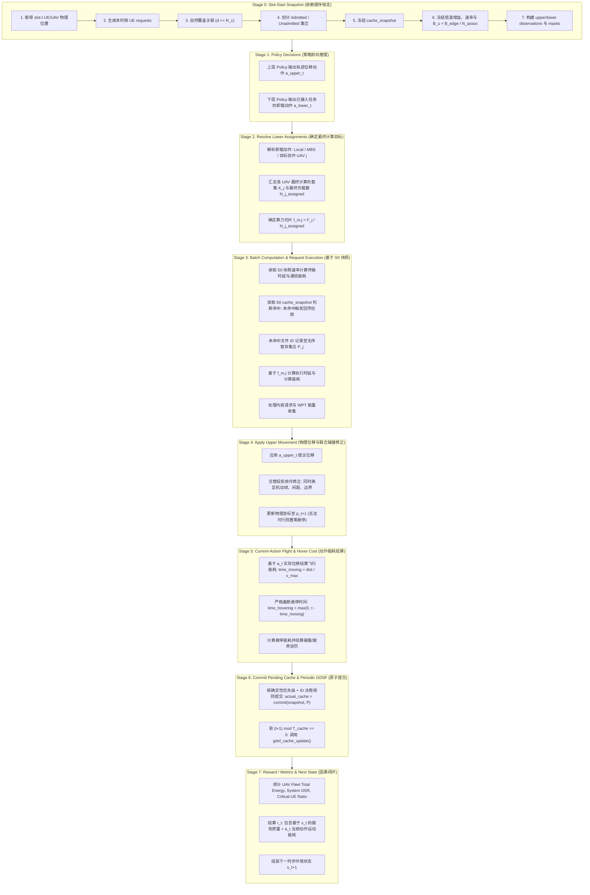

# CANONICAL_SEMANTICS_SPEC.md: 多 UAV MEC 协同优化系统规范语义与实现规格书

> **文档性质与效力声明**：
> 1. 本规格书为项目 Clean-Slate 重构阶段的**唯一真理源 (Single Source of Truth, SSOT)**。
> 2. 所有历史实验数据、模型权重 (Checkpoints)、图表与统计表格均已统一标记为 `HISTORICAL_ONLY`，不得作为最终学位论文的正文结论。
> 3. 本阶段严格维持只读状态：**不修改 Python 源代码，不训练模型，不实施自动修复**。所有后续代码修复、单元测试与重训必须严格遵照本规格书执行。
> 4. **SSOT 冻结状态**：本规格书已通过最终 **SSOT Errata Pass** 闭环审计并正式**冻结**。下一阶段直接进入 TDD Repair，不再开展新的宏观审计。

---

## 0. 核心科学决策锁定声明 (Decision Locks)

根据系统审计、理论建模与 Errata Pass 终审，以下核心科学与工程决策已正式锁定，禁止在后续实现中擅自变更：

* **Service Admission**: `FORCE_SERVICE_ADMISSION_CANONICAL = FALSE`
* **Computing Model**: `COMPUTING_MODEL = BATCH_FINAL_LOAD_EQUAL_SHARING`
* **Cache Semantics**: `CACHE_MODEL = SLOT_START_SNAPSHOT_END_SLOT_COMMIT`
* **Service Physics**: `SERVICE_PHYSICS = SLOT_START_SNAPSHOT`
* **Lower PPO Probability**: `LOWER_LOGPROB = JOINT_SUM`
* **Lower Reward Energy**: `LOWER_REWARD_ENERGY = ASSIGNMENT_CAUSAL_NONFLIGHT`
* **Lower Reward Scope**: `LOWER_REWARD_SCOPE = GLOBAL_TEAM`
* **Request Truncation**: `SILENT_TRUNCATION_ALLOWED = NO`
* **Main Experiment Seeds**: `N_TRAIN_SEEDS = 5`, `N_WORKLOAD_SEEDS = 10`
* **Constraint Mechanism**: `CONSTRAINT_MECHANISM = VIOLATION_DRIVEN_ADAPTIVE_PENALTY`
* **System Energy Term**: `UAV Fleet Total Energy`
* **Critical Battery Metric Term**: `Critical-UE Ratio` (低电量用户比例)

---

## 1. 新旧语义与实现对比矩阵 (Old vs New Semantics Table)

| 维度 / 模块 | 历史实现缺陷 (`LEGACY_ONLY`) | 规范新语义 (`CANONICAL_LOCKED`) | 科学与工程设计理由 |
| :--- | :--- | :--- | :--- |
| **服务请求接入 (Admission)** | 默认 `False` 但运行脚本混用 `True`；`True` 时无视 100m 覆盖半径将边缘 UE 强塞给最近 UAV | **严格固定为 `False`**：仅自然落入 UAV 覆盖半径 $R_c$ 内的 UE 允许被接入该 UAV | 确立清晰因果链：上层轨迹负责覆盖接入，下层策略负责已接入任务的协同卸载 |
| **覆盖外请求惩罚** | 强行接入或混淆接入统计，掩盖上层轨迹覆盖不足的问题 | 覆盖外请求直接标记为未服务（Unserved），计入全局 DSR 与惩罚，**不进入下层策略动作集** | 防止下层卸载策略为上层无人机未飞到位造成的失职“背锅” |
| **算力切片模型 (Computing)** | 历史 C2 语义：循环迭代中遇外迁即减 1，本地执行不减，形成时序阶跃与次序耦合 | **批处理最终负载均分算力模型 (Batch Final-Load Equal Processor Sharing)** | 彻底消除由于 Python 循环遍历次序导致的非物理算力漂移与非对称性 |
| **请求/UAV 处理次序** | 启发式随机打乱，学习模型按距离排序，UAV 按 0~4 遍历，结果随次序改变 | **时序置换严格不变性 (Permutation Invariance)**：遍历顺序仅用于日志和张量组装 | 物理仿真结果严格独立于数据结构在内存中的迭代次序 |
| **缓存生命周期 (Cache)** | 动态随走随改；高序号目标 UAV 的 `_working_cache` 会被自身的初始化语句覆盖清零 | **时隙初快照 + 时隙末原子提交 (Slot-Start Snapshot + End-of-Slot Commit)** | 读写解耦，同隙不产生因果穿越，消除跨 UAV 协作缓存覆写 Bug |
| **缓存提交确定性 (Commit)** | 依赖暂存列表追加顺序，溢出截断受 UAV 处理先后影响 | **确定性优先级 + ID 决胜规则**：无序候选集按 GDSF/EMA 得分降序，相同得分以 `file_id` 升序仲裁 | 保证任意输入排列下 commit 结果绝对一致 |
| **UE-UAV 接入带宽** | $B_{\text{edge}} / N_{\text{assoc}}$，历史分析曾将其与算力耦合混淆 | **信道时隙内不变量**：带宽由时隙初静态关联决定，完全独立于后续卸载决策 | 严格区分接入信道静态切片与计算资源动态分配 |
| **下层 PPO 对数似然** | 对各请求对数似然求和后除以有效数量，实为比率的几何平均（$M$ 次方根） | **标准联合对数似然 $\sum_{m \in \mathcal{V}} \log \pi_m$**，禁止除以 `valid_count` | 恢复因式分解联合策略标准数学测度，与经典 MAPPO 理论一致 |
| **下层强化学习奖励** | 包含全场飞行能耗（Move+Hover）且滞后 1 步，受外生运动噪声强烈污染 | **因果可控奖励**：仅包含因卸载决策因果可改变的计算通信能耗，**彻底剔除飞行与悬停能耗** | 下层策略仅对卸载去向负责，实现干净的高信噪比信贷分配 (Credit Assignment) |
| **下层约束调节机制** | 声称“拉格朗日乘子”、“对偶上升”或“原始-对偶” | **基于约束违反量的自适应惩罚机制 (Violation-Driven Adaptive Constraint Penalty)** | 准确表述启发式步长非减惩罚项，杜绝对偶收敛性虚假声称 |
| **下层奖励共享范围** | 全局统一团队奖励标量：`[same_reward] * NUM_UAVS` | **保留 `GLOBAL_TEAM`**，明确标注信贷稀释为方法客观局限 | 维护集中训练分布式执行 (CTDE) 框架下的全局协作目标，防止自私博弈 |
| **请求容量与截断** | 硬编码限制 30 个；第 31+ 个请求直接被静默回退为全启发式贪心决策 | **全容量 Padding 覆盖 ($\ge 100$)**，无效 slot 用 mask 屏蔽，**100% 由策略决策** | 坚决禁止人为静默 Fallback 掩盖容量瓶颈，保证决策自主性 |
| **系统级总能耗命名** | 历史偶尔模糊称为“全网能耗”或“系统总能耗” | **严格统一定义为 `UAV Fleet Total Energy`**（无人机机群总能耗） | 明确不包含基站市电能耗，也不累加用户终端电池能耗 |
| **临界电量用户指标** | 历史称为 `UE Offline Rate`，误导审稿人以为终端已关机断电 | **严格统一定义为 `Critical-UE Ratio`**（低电量用户比例） | 准确反映电量低于门限并转入低功耗 WPT 模式的物理事实 |
| **主实验统计协议** | 历史采用 3 训练种子，基线贪心声称重训 | **5 训练种子 × 10 工作负载种子**；贪心基线仅重新评估 (Reevaluate) | 建立严谨统计显著性与效应量评估基准 |

---

## 2. 离散时隙物理演化执行管线 (Slot Transition Timeline)

### 2.1 Stage-0 时隙初快照生成与严格依赖顺序 (Dependency Order Locked)

为消除因果倒置（如在 association 未知前计算 $B_{\text{edge}} / N_{\text{assoc}}$），时隙 $t$ 初期的 Snapshot 组装必须严格按以下 7 步次序执行：

1. **获取位置基准**：取得 slot-$t$ 开始时全体 UE 物理坐标 $\mathbf{w}_u$ 与全体 UAV 物理坐标 $\mathbf{q}_i(t)$；
2. **生成用户请求**：全体 UE 依据自身当前电量及 Zipf 分布独立生成本时隙请求（服务请求、内容请求或能量请求）；
3. **执行自然覆盖关联**：依据空间硬覆盖半径 $R_c = 100\,\mathrm{m}$ 执行物理关联判定，确定每台 UE 是否被任一 UAV 覆盖；被覆盖者关联至距离最近的 UAV；
4. **划分准入与非准入集合**：
   * 覆盖内服务请求划入各 UAV 的待决策服务集 $\mathcal{M}_i$（Admitted Set）；
   * 覆盖外服务请求划入未准入集合（Unadmitted Set），置 `ue.assigned = False`；
5. **并发冻结缓存快照**：各 UAV 建立持久化缓存状态的只读快照：
   $$\mathbf{c}_i^{\text{snapshot}} \leftarrow \mathbf{c}_i.\text{copy}(), \quad \mathcal{P}_i \leftarrow \emptyset, \quad \forall i \in \{0, \dots, N_{\text{UAV}}-1\}$$
6. **冻结通信信道与带宽切片**（此时关联与位置已完全确定）：
   * 计算三维信道增益 $g(d_{u, i})$、$g(d_{i, j})$、$g(d_{i, \text{mbs}})$；
   * 统计各 UAV 关联 UE 总数 $N_i^{\text{assoc}} = |\mathcal{A}_i|$；
   * 计算正交均分接入带宽 $B_u = \dfrac{B_{\text{edge}}}{N_i^{\text{assoc}}}$；
   * 计算接入速率 $R_{u, i}^{\text{ue-uav}}$、协作速率 $R_{i, j}^{\text{uav-uav}}$ 及回传速率 $R_{i, \text{mbs}}^{\text{backhaul}}$；
7. **组装局部观测与动作掩码**：基于上述已冻结数据，构造上层轨迹 Policy 观测张量与下层卸载 Policy 观测张量及合法动作掩码 `action_masks`。

> **核心禁令**：严禁在关联关系（Association）确定之前提前计算依赖关联数量的带宽 $B_{\text{edge}} / N_{\text{assoc}}$。

---

### 2.2 离散时隙演化完整管线 (Canonical Timeline S0→S7)

在统一时隙 $t$ 内部，计算、通信、物理位移与奖励结算严格遵循 **S0 $\to$ S7** 阶段演化：



---

### 2.3 物理快照与因果对齐公理 (Causal Alignment Axioms)

1. **Service Physics 不可变快照公理**：
   在时隙 $t$ 内部，所有任务关联、信道增益、通信传输速率、缓存命中状态，**全部且仅允许读取 Stage 0 冻结的 Immutable Snapshot**。
   *上层动作 $a_t^{\text{upper}}$ 所引发的物理位移发生在 Stage 4，该位移绝对不得反向（retroactively）修改当前时隙正在执行的 Stage 3 业务信道*。代码中禁止在服务执行阶段重新调用基于实时 `uav.pos` 的信道计算函数。
2. **$(s_t, a_t, r_t, s_{t+1})$ 因果闭环公理**：
   时步 $t$ 结算的环境奖励 $r_t$ 严格定义为：
   $$r_t = \mathcal{R}_{\text{service}}(s_t, a_t^{\text{lower}}) + \mathcal{R}_{\text{motion}}(a_t^{\text{upper}})$$
   * $\mathcal{R}_{\text{service}}$：基于当前状态 $s_t$（及其冻结快照）和下层动作 $a_t^{\text{lower}}$ 计算的任务完成 QoS 与非飞行卸载能耗；
   * $\mathcal{R}_{\text{motion}}$：由当前上层动作 $a_t^{\text{upper}}$ 真实驱动产生的位移飞行能耗、悬停能耗及碰撞惩罚。
   彻底消除历史实现中“第 $t$ 步奖励包含第 $t-1$ 步位移能耗，且第 $T$ 步末尾动作能耗丢失”的严重时序倒挂缺陷。

---

## 3. 服务请求接入与分流数学定义 (Service Admission Specification)

### 3.1 自然覆盖关联规则
对于时隙 $t$ 空间中位置为 $\mathbf{w}_u \in \mathbb{R}^2$ 的任意用户终端 $u \in \mathcal{U}$（$|\mathcal{U}| = N_{\text{UE}} = 100$）：
1. 候选服务无人机集合定义为落入物理覆盖硬半径 $R_c = 100\,\mathrm{m}$ 内的无人机：
   $$\mathcal{C}_u = \left\{ i \in \{0, \dots, N_{\text{UAV}}-1\} \;\middle|\; \|\mathbf{w}_u - \mathbf{q}_i(t)\| \le R_c \right\}$$
2. 关联判定规则：
   * 若 $\mathcal{C}_u \ne \emptyset$：UE $u$ 关联至距离最近的无人机 $i^* = \arg\min_{i \in \mathcal{C}_u} \|\mathbf{w}_u - \mathbf{q}_i(t)\|$，置其状态为已关联 `ue.assigned = True`，该请求加入无人机 $i^*$ 的待处理服务集合 $\mathcal{M}_{i^*}$。
   * 若 $\mathcal{C}_u = \emptyset$：置 `ue.assigned = False`。**严禁以任何“强制接纳 (Force Admission)”为名将其挂载至最近的覆盖外无人机**。

### 3.2 覆盖外未接入请求的结算边界
对于 $\mathcal{C}_u = \emptyset$ 的未接入服务请求 $\mathcal{T}_u$：
* **下层决策隔离**：该请求**不分配动作槽位**，不构建特征向量，不进入下层 Policy 观测张量与动作空间；
* **时延与服务质量结算**：其完成时延强制赋值为系统未服务惩罚时延 $T_{\text{penalty}} = 20.0\,\mathrm{s}$，截止时间满足指示函数 $\mathbb{I}[\text{satisfied}] = 0$；
* **系统级指标纳入**：该请求严格计入全系统统计的 System-Level DSR 与用户覆盖公平性 JFI 指标，以此作为驱动上层轨迹策略（Upper Policy）主动机动并提供有效覆盖的强化学习反馈；
* **下层策略解耦**：下层卸载策略的训练奖励中**不包含**针对未接入请求的任何时延与超时惩罚。

---

## 4. 批处理最终负载均分算力模型与运动学修正 (Computing & Kinematics)

### 4.1 任务分流与负载汇总
设时隙 $t$ 内通过正常关联进入各 UAV 的总接入任务集为 $\mathcal{M} = \bigcup_{i=0}^{N_{\text{UAV}}-1} \mathcal{M}_i$。下层卸载策略为每个任务 $m \in \mathcal{M}_i$ 给出决策 $a_m \in \{0, 1, 2+j\}$：
* $a_m = 0$：本地 UAV $i$ 执行；
* $a_m = 1$：回传 MBS 执行；
* $a_m = 2+j$：协作转移至指定无人机 $j$ 执行 ($j \ne i$)。

对全网任意无人机 $j \in \{0, \dots, N_{\text{UAV}}-1\}$，其在时隙 $t$ 最终承载的计算任务集合 $\mathcal{K}_j$ 定义为：
$$\mathcal{K}_j = \left\{ m \in \mathcal{M}_j \;\middle|\; a_m = 0 \right\} \cup \bigcup_{i \ne j} \left\{ m \in \mathcal{M}_i \;\middle|\; a_m = 2+j \right\}$$
定义无人机 $j$ 的最终计算负载规模为：
$$N_j^{\text{assigned}} = \left| \mathcal{K}_j \right|$$

### 4.2 算力切片与时延能耗计算方程
对于最终指派给无人机 $j$ 的任意任务 $m \in \mathcal{K}_j$（其输入数据量为 $D_m$，计算密度为 $\omega_{s_m}$，总计算周期需求为 $C_m = D_m \cdot \omega_{s_m}$）：

1. **计算频率切片**：
   $$f_{m, j} = \begin{cases} \dfrac{F_j}{N_j^{\text{assigned}}}, & \text{if } N_j^{\text{assigned}} > 0 \\ 0, & \text{if } N_j^{\text{assigned}} = 0 \end{cases}$$
2. **计算执行时延**：
   $$T_{\text{comp}, m} = \frac{C_m}{f_{m, j}} = \frac{C_m \cdot N_j^{\text{assigned}}}{F_j}$$
3. **计算能耗消耗**（依据 CMOS 动态功耗模型）：
   $$E_{\text{comp}, m} = K_{\text{cpu}} \cdot C_m \cdot f_{m, j}^2 = K_{\text{cpu}} \cdot C_m \cdot \left(\frac{F_j}{N_j^{\text{assigned}}}\right)^2$$
   该项能耗计入执行端无人机 $j$ 的单时隙计算能耗 $E_{\text{comp}, j}$。

### 4.3 MBS 计算模型与置信度解耦
对于指派给基站的任务 $m$（$a_m = 1$）：
* 其计算时延为：$T_{\text{comp}, m}^{\text{mbs}} = \dfrac{C_m}{F_{\text{mbs}}}$，其中 $F_{\text{mbs}}$ 为常数，不设排队退化；
* 基站计算能耗属于电网侧供电，**严格禁止计入无人机机群总能耗**。

### 4.4 顺序置换不变性定理 (Order Invariance Theorem)
设 $\pi$ 为任意对任务集合 $\mathcal{M}$ 的排列映射（无论按距离排序、反向排序或随机乱序）。在相同的下层决策映射 $\mathbf{a}$ 下，最终分配集合 $\mathcal{K}_j$ 均为确定性无序集合，满足：
$$\forall \pi, \quad N_j^{\text{assigned}}(\pi(\mathcal{M})) \equiv N_j^{\text{assigned}}(\mathcal{M}), \quad \forall m, \; T_{\text{comp}, m}(\pi) \equiv T_{\text{comp}, m}$$
任何由于执行次序导致的指标变动均属于严重 Bug。

### 4.5 UE-UAV 接入带宽：时隙内信道静态切片 (UE-UAV Bandwidth Invariant)
与批处理算力模型（Phase C/D 中动态 $F_j/N_j^{\text{assigned}}$）严格区分，UE-UAV 通信带宽属于**时隙初关联快照决定的静态切片**，不随后续卸载决策而改变。

对于时隙 $t$ 已关联至 UAV $i$ 的 UE 集合 $\mathcal{A}_i$（由 Stage 0 自然覆盖关联确定，$|\mathcal{A}_i| = N_i^{\text{assoc}}$），每 UE 分得上行带宽：
$$B_u = \frac{B_{\text{edge}}}{N_i^{\text{assoc}}}$$

**不变性公理**：在固定信道快照下，无论 service request 最终被指派为 Local、MBS 还是协作 UAV $j$，该 UE 的 UE $\to$ UAV 上行带宽 $B_u$ 恒定不变。其因果根因在于：带宽分母 $N_i^{\text{assoc}}$ 只依赖时隙初关联集合，与 lower policy action 无关。
```text
UE_UAV_BANDWIDTH is invariant to Local / MBS / Coop assignment
```
严禁将其描述为 processor-sharing 的顺序耦合。二者分属完全不同的物理层次：
* **接入带宽**：association-level 静态切片，slot-start 冻结；
* **算力切片**：assignment-level 动态均分，slot-end 由 final load 决定。

### 4.6 碰撞排斥修正联合可行性规格 (Joint Feasibility Collision Repair)

碰撞修正**严禁仅执行简单的“排斥外推后单独做速度球投影”**，因为单机速度截断极易打破刚拉开的安全间距，重新引发碰撞。

Canonical 碰撞位移修正必须在时步结束前**同时、联合满足以下全部物理约束**：
1. **最大速度机动球约束**：$\|\Delta \mathbf{q}_i\| \le v_{\max} \Delta t, \quad \forall i$；
2. **机间最小安全间距**：$\|\mathbf{q}_i(t+1) - \mathbf{q}_j(t+1)\| \ge d_{\min} = 200\,\mathrm{m}, \quad \forall i \ne j$；
3. **二维仿真区域边界**：$\mathbf{q}_i(t+1) \in [d_{\text{bound}}, W - d_{\text{bound}}] \times [d_{\text{bound}}, H - d_{\text{bound}}], \quad \forall i$；
4. **严格非负悬停时间**：$t_{\text{hover}, i} = \max\left(0, \; \tau - \frac{\|\Delta \mathbf{q}_i\|}{v_{\max}}\right) \ge 0, \quad \forall i$。

**算法实施规范**：
* 采用交替投影法 (Alternating Projections)，在排斥位移、速度球约束和区域边界之间迭代投影；
* 循环退出时，必须执行全局前置断言（Assert），核验上述 4 项约束无一违反；
* **确定性安全回退 (Deterministic Safe Fallback)**：若在有限步迭代（如 $K_{\max} = 20$）内仍无法求得同时满足速度与安全间距的联合可行解，算法触发确定性安全回退：**强制将参与冲突的 UAV 在当前时隙的位移直接置零（$\Delta \mathbf{q}_i = \mathbf{0}$，保持上一时步坐标悬停），并对相应 UAV 施加满额碰撞惩罚 `COLLISION_PENALTY`**。
* **物理防线**：坚决杜绝瞬间移动 (Teleportation)、负悬停能耗倒扣以及“修了速度却掩盖了碰撞”的不自洽实现。

---

## 5. 缓存双态快照与原子提交生命周期 (Cache Lifecycle & Commit)

### 5.1 状态分离机制
每架无人机 $i$ 维护两类独立的缓存数据实体：
1. `uav.cache` ($\mathbf{c}_i \in \{0, 1\}^{K_{\text{files}}}$)：持久化存储状态，表示该无人机当前物理持有的文件布尔索引；
2. `uav.pending_cache` ($\mathcal{P}_i \subset \{0, \dots, K_{\text{files}}-1\}$)：动态暂存集合，记录时隙内因任务处理而需从 MBS 预取并写入的新文件。

### 5.2 时隙演化协议
1. **时隙开始 (Slot Start)**：
   全场无人机并发创建冻结快照：
   $$\mathbf{c}_i^{\text{snapshot}} \leftarrow \mathbf{c}_i.\text{copy}(), \quad \mathcal{P}_i \leftarrow \emptyset, \quad \forall i \in \{0, \dots, N_{\text{UAV}}-1\}$$
2. **决策与执行期 (Execution Phase)**：
   全时隙内所有本地执行、协作执行的缓存命中查询，**一律且只允许读取** $\mathbf{c}^{\text{snapshot}}$：
   * 若 $\mathbf{c}_{\text{exec}}^{\text{snapshot}}[\text{file\_id}] == 1$：缓存命中，文件获取时延 $T_{\text{fetch}} = 0$；
   * 若 $\mathbf{c}_{\text{exec}}^{\text{snapshot}}[\text{file\_id}] == 0$：缓存未命中，产生回传拉取时延 $T_{\text{fetch}} = \frac{8 L_f}{R_{\text{uav-mbs}}}$ 与接收能耗，并将 $\text{file\_id}$ 加入执行端无人机的暂存集：$\mathcal{P}_{\text{exec}} \leftarrow \mathcal{P}_{\text{exec}} \cup \{\text{file\_id}\}$。
   * **时隙内不可见性**：在时隙 $t$ 内部，同一无人机后续请求若请求相同文件，只要其在 $\mathbf{c}^{\text{snapshot}}$ 中为 0，依然视为未命中。严禁时隙内即写即读造成的跨任务因果干扰。
3. **时隙结束原子提交 (Slot End Commit)**：
   在所有无人机请求全部处理完毕后，执行无序偏倚的确定性原子提交：
   $$\mathbf{c}_i \leftarrow \text{commit}(\mathbf{c}_i^{\text{snapshot}}, \mathcal{P}_i), \quad \mathcal{P}_i \leftarrow \emptyset$$
   彻底消除先遍历 UAV 写入后遍历 UAV 暂存区导致的数据被覆写缺陷。

### 5.3 严格置换不变性提交规则 (Deterministic Commit Rule)

如果暂存文件总容量超出无人机剩余存储空间，提交算法**绝不允许依赖**：
* insertion order（任务进入暂存区的先后时间）；
* Python `list` / `set` 的内存迭代次序；
* 各 UAV 请求处理的循环次序。

**规范提交算法 (Deterministic Selection Protocol)**：
1. 将写入该无人机的所有待存文件提取为无序候选集 $\mathcal{F}_i^{\text{cand}}$；
2. 为每个候选文件 $f \in \mathcal{F}_i^{\text{cand}}$ 计算客观可复现的归一化优先级得分：
   $$\text{score}(f) = \frac{\text{EMA}_f}{\text{FILE\_SIZES}[f]}$$
   复用系统已有的 GDSF/EMA 指数移动平均流行度统计；
3. **绝对决胜仲裁 (Deterministic Tie-Break)**：若两文件得分完全相同，以全局唯一的 `file_id` 升序作为第二判据；
4. 按该确定规则构建有序优先级队列，贪心装载直至容量不足；未能装入的文件在本时隙放弃装入（保留至下一周期由全局 GDSF 统一裁决）。
5. **数学保证**：对于任意输入序列置换 $\sigma$，满足 $\text{commit}(\mathbf{c}^{\text{snapshot}}, \sigma(\mathcal{P})) \equiv \text{commit}(\mathbf{c}^{\text{snapshot}}, \mathcal{P})$。

---

## 6. 下层 MAPPO 联合对数似然与比率契约 (Lower PPO Contract)

### 6.1 联合概率公式规范
下层决策模型在单架无人机面对有效任务集合 $\mathcal{V}_i = \{0, \dots, M_i-1\}$ 时，采用标准独立因子化联合概率分布。

1. **联合对数似然计算**：
   $$\log \pi_\theta(\mathbf{a}_i \mid \mathbf{o}_i) = \sum_{m \in \mathcal{V}_i} \log \pi_\theta(a_{i, m} \mid \mathbf{o}_i)$$
   **禁止除以有效任务数 $|\mathcal{V}_i|$**。历史代码中的 `/ denom` 必须彻底移除并归档为 `LEGACY_ONLY`。
2. **Padding 屏蔽**：
   张量中的无效填充槽位（$m \ge M_i$）通过动作掩码强制屏蔽，在计算 log_prob 时严格乘以 0 掩码，绝不进入对数和。
3. **PPO 重要性采样比率**：
   $$r_i(\theta) = \exp\left( \log \pi_\theta(\mathbf{a}_i \mid \mathbf{o}_i) - \log \pi_{\theta_{\text{old}}}(\mathbf{a}_i \mid \mathbf{o}_i) \right)$$
   优化目标中的截断项为：
   $$\mathcal{L}_{\text{clip}}(\theta) = \hat{\mathbb{E}}\left[ \min\left( r_i(\theta)\hat{A}_i, \; \text{clip}(r_i(\theta), 1-\epsilon, 1+\epsilon)\hat{A}_i \right) \right]$$

### 6.2 梯度方差控制与工程调优规格
由于多任务对数似然求和会导致联合分布的熵和方差增大，在实现中应提供以下工程保障：
* 熵正则化系数：$\mathcal{H}(\pi_\theta) = \sum_{m \in \mathcal{V}_i} \mathcal{H}(\pi_{\theta, m})$；
* 配合梯度范数裁剪 `torch.nn.utils.clip_grad_norm_(..., max_norm=0.5)` 防御更新爆炸；
* 确保数值稳定，杜绝 NaN 扩散。

---

## 7. 奖励函数解耦与系统/训练指标边界 (Reward & Metric Specifications)

### 7.1 系统级总体指标 (System-Level Metrics — 论文最终展示)
系统宏观指标面向整个多无人机 MEC 网络服务质量，统计全集始终为**全场所有 UE 在时隙内生成的全部服务请求 $\mathcal{T}_{\text{all}}$**（包含未接入请求）：

1. **System DSR (全系统截止时间满足率)**：
   $$\text{DSR}_{\text{sys}} = \frac{\sum_{u \in \mathcal{T}_{\text{all}}} \mathbb{I}[T_u \le T_u^{\text{dl}}]}{|\mathcal{T}_{\text{all}}|}$$
2. **UAV Fleet Total Energy (无人机机群总能耗)**：
   $$E_{\text{fleet}} = \sum_{i=0}^{N_{\text{UAV}}-1} \left( E_{\text{fly}, i} + E_{\text{hover}, i} + E_{\text{wpt}, i} + E_{\text{comp}, i} + E_{\text{comm}, i} \right)$$
   *严禁将 MBS 计算能耗计入，严禁将 UE 发射能耗直接作为代数项加和*。
3. **Jain's Fairness Index (服务覆盖公平性)**：基于所有 100 个 UE 历史累积的服务时延与覆盖次数计算。
4. **Critical-UE Ratio (低电量用户比例)**：电量低于临界阈值 $E_{\text{crit}}$ 的 UE 比例：
   $$\text{Critical-UE Ratio} = \frac{|\{u \in \mathcal{U} \mid B_u < E_{\text{crit}}\}|}{|\mathcal{U}|}$$
   **术语锁定**：论文正文、figure label、table header、metric description 必须使用 `Critical-UE Ratio` 或中文 `低电量用户比例`。历史字段名 `offline_rate` 可为代码兼容暂时保留，但**严禁**在论文中称为"UE Offline Rate / 终端离线率 / UE 已关机 / UE 已离线 / UE 寿命耗尽"——除非未来代码真实实现该状态。

---

### 7.2 下层因果能耗范围与奖励结构 (Lower Causal Energy Scope Locked)

下层卸载策略的反馈信号遵循**因果可归因原则 (Assignment-Causal Non-Flight)**，仅对其能控制的已接入任务集合 $\mathcal{M}$ 结算。

#### 7.2.1 严格能耗准入清单
下层能耗奖励分量 $R_{\text{energy}}^{\text{lower}}$ 的计算必须通过独立的专属计量代码累加，**严禁从全场总能耗 $E_{\text{fleet}}$ 中做减法反推**：

* **允许计入的分量 (Causally Controlled by Offloading)**：
  1. 服务任务本地计算能耗：$E_{\text{comp}, m}^{\text{local}} = K_{\text{cpu}} C_m (F_i / N_i^{\text{assigned}})^2$；
  2. 服务任务协作计算能耗：$E_{\text{comp}, m}^{\text{coop}} = K_{\text{cpu}} C_m (F_j / N_j^{\text{assigned}})^2$；
  3. 服务任务协作链路通信能耗：源端发送能耗 $P_{\text{tx}} T_{\text{uav-uav}}$ 与目标端接收能耗 $P_{\text{rx}} T_{\text{uav-uav}}$；
  4. 服务任务回传链路发射能耗：源端发送至 MBS 的回传能耗 $P_{\text{bh}}^{\text{tx}} T_{\text{uav-mbs}}$；
  5. 服务任务缓存未命中引发的接收能耗：因该任务被指派至某 UAV 而直接导致的 MBS 文件拉取接收能耗 $P_{\text{bh}}^{\text{rx}} T_{\text{fetch}}$。
* **绝对禁止计入的分量 (Non-Causal External Disturbance)**：
  1. 无人机水平飞行能耗 $E_{\text{fly}}$（受上层轨迹决策控制）；
  2. 无人机滞空悬停能耗 $E_{\text{hover}}$（受上层轨迹决策控制）；
  3. 无线能量传输发射能耗 $E_{\text{wpt}}$（由覆盖 UE 能量状态触发，非卸载决策控制）；
  4. 内容下载任务相关通信能耗（非计算密集型服务卸载范畴）；
  5. 能量请求相关能耗。

#### 7.2.2 下层标量奖励构成
下层团队奖励统一为：
$$r_i^{\text{lower}} = R_{\text{dsr}}^{\text{lower}} + R_{\text{lat}}^{\text{lower}} + R_{\text{energy}}^{\text{lower}} + R_{\text{mbs}}^{\text{lower}} + R_{\text{constraint}}^{\text{lower}}, \quad \forall i$$
其中：
* $R_{\text{dsr}}^{\text{lower}} = w_{\text{dsr}} \cdot \dfrac{\sum_{m \in \mathcal{M}} \mathbb{I}[T_m \le T_m^{\text{dl}}]}{|\mathcal{M}|}$；
* $R_{\text{lat}}^{\text{lower}} = -w_{\text{lat}} \cdot \dfrac{\sum_{m \in \mathcal{M}} T_m}{|\mathcal{M}| \cdot T_{\text{norm}}}$；
* $R_{\text{energy}}^{\text{lower}} = -w_{\text{eng}} \cdot \dfrac{\sum_{m \in \mathcal{M}} E_{\text{causal}, m}}{N_{\text{UAV}} \cdot E_{\text{ref}}}$；
* $R_{\text{mbs}}^{\text{lower}} = -w_{\text{mbs}} \cdot \dfrac{|\{m \in \mathcal{M} \mid a_m = 1\}|}{|\mathcal{M}|}$；
* 共享范围锁定为 `LOWER_REWARD_SCOPE = GLOBAL_TEAM`。

---

### 7.3 基于约束违反量的自适应惩罚机制 (Violation-Driven Adaptive Penalty)

彻底废除“拉格朗日乘子”、“拉格朗日对偶上升”及“原始-对偶优化”等错误学术声称，统一规范为**基于约束违反量的自适应惩罚机制**：

1. **机制术语锁定**：
   * 英文：`Violation-Driven Adaptive Constraint Penalty`；
   * 中文：`基于约束违反量的自适应惩罚机制`；
   * 惩罚奖励项记为 $R_{\text{constraint}}^{\text{lower}}$；
   * 惩罚强度调节参数记为 $\rho_{\text{dsr}}, \rho_{\text{mbs}}$（禁止在数学表述中使用 $\lambda$）。
2. **惩罚项计算公式**：
   $$R_{\text{constraint}}^{\text{lower}} = -\rho_{\text{dsr}} \cdot \max\left(0, \; \text{DSR}_{\text{target}} - \text{DSR}^{\text{lower}}\right) - \rho_{\text{mbs}} \cdot \max\left(0, \; \text{MBS}^{\text{lower}} - \text{MBS}_{\text{ceiling}}\right)$$
3. **参数自适应更新规则**：
   $$\rho_{k+1} = \operatorname{clip}\left(\rho_k + \eta \, v_k, \; 0, \; \rho_{\max}\right)$$
   其中 $v_k$ 为时隙评估窗口内的违规量，$\eta > 0$ 为惩罚增长步长。
4. **学术边界明确声明**：
   * 该机制为**启发式违反量驱动 (Violation-Driven)**；
   * 在发生违规时惩罚因子单调递增，不具备双向对偶摆动；
   * **明确不属于拉格朗日对偶上升，不属于原始-对偶方法，不对收敛于鞍点做任何对偶收敛性声称**。代码历史变量 `lambda_dsr` 仅作局部标识兼容，论文统一按此口径表述。

---

## 8. 请求容量与计算复杂度规范 (Request Capacity & Complexity)

### 8.1 彻底消除静默回退
新体系下严格锁定：
```text
SILENT_TRUNCATION_ALLOWED = NO
```
系统参数设定为：
$$\text{MAX\_OFFLOAD\_REQUESTS\_PER\_UAV} = \text{NUM\_UES} = 100$$
确保在任何单机极端聚集场景下，所有物理准入的服务请求 100% 进入下层神经网络前向推理并由策略直接决策。

### 8.2 Dense Attention 计算复杂度客观说明
规格书对张量填充开销作科学客观表述，杜绝不实断言：
1. **FLOPs 主导性**：当前采用的 Dense Padded Attention 其矩阵乘法浮点计算量（FLOPs）主要由最大填充长度（Max Padded Length = 100）决定，而非当期有效请求数；
2. **掩码功能界定**：`valid_mask` 的核心作用是保证 Attention 权重归一化与 Loss 反向传播的**数学语义正确性**，在标准的 Dense 算子下**并不直接降低前向计算 FLOPs**；
3. **工程取舍理由**：在当前网络规模（100 个 UE，单机 100-token）下，GPU 前向耗时极短，以此微小的计算冗余换取“全任务 100% 策略决策、彻底根除静默启发式偏差”的理论完备性完全符合系统收益；
4. **未来优化路线**：若未来扩展到上千用户导致计算开销显著，可在不改变任何物理与策略语义的前提下引入 Packed Sequence 或 Dynamic Ragged Batching 算子优化。

---

## 9. 源代码修改映射表 (Source Files Modification Plan)

后续进入代码实现阶段时，需要修改的文件及关键职责如下（当前阶段保持只读）：

| 待修改文件 | 预定修改职责与内容 |
| :--- | :--- |
| [`config.py`](file:///Users/wangpengfei/Documents/毕业论文/我的论文/wodexuexi/config.py) | 锁定 `FORCE_SERVICE_ADMISSION = False`；设置 `MAX_OFFLOAD_REQUESTS_PER_UAV = NUM_UES = 100`；明确 `LEGACY_C2_*` 宏定义 |
| [`environment/env.py`](file:///Users/wangpengfei/Documents/毕业论文/我的论文/wodexuexi/environment/env.py) | 重构 S0 $\to$ S7 执行时序（Stage 0 依赖顺序修正，Stage 4 位移后置）；联合可行性碰撞修正（交替投影 + 悬停回退）；覆盖硬边界判定与未服务标记；缓存快照并发冻结 |
| [`environment/uavs.py`](file:///Users/wangpengfei/Documents/毕业论文/我的论文/wodexuexi/environment/uavs.py) | 实现批处理最终负载均分算力模型；双态缓存快照与原子提交；置换不变性提交算法；非负悬停时间保护 |
| [`environment/comm_model.py`](file:///Users/wangpengfei/Documents/毕业论文/我的论文/wodexuexi/environment/comm_model.py) | 确保 UE-UAV 带宽只读 S0 冻结快照，明确标注其与卸载动作的数学解耦 |
| [`marl_models/offload_mappo/offload_mappo.py`](file:///Users/wangpengfei/Documents/毕业论文/我的论文/wodexuexi/marl_models/offload_mappo/offload_mappo.py) | 移除 `/ denom`，恢复联合对数似然和 $\sum \log \pi_m$；适配 100 维输入容量；自适应惩罚项术语对齐 |
| [`marl_models/joint_mappo/joint_mappo.py`](file:///Users/wangpengfei/Documents/毕业论文/我的论文/wodexuexi/marl_models/joint_mappo/joint_mappo.py) | 卸载分支同步移除 `/ denom`，统一概率测度合同 |
| [`run_hierarchical_mappo_experiment.py`](file:///Users/wangpengfei/Documents/毕业论文/我的论文/wodexuexi/run_hierarchical_mappo_experiment.py) | 奖励函数重构（独立因果计量，彻底剥离飞行/悬停能耗）；锁定 CLI 默认参数；对齐自适应惩罚更新参数 $\rho$ |
| [`run_baseline_matrix_v2.py`](file:///Users/wangpengfei/Documents/毕业论文/我的论文/wodexuexi/run_baseline_matrix_v2.py) | 统一配置与 CLI 默认值，清理历史 force-admission 参数 |
| [`run_baseline_comparison_experiment.py`](file:///Users/wangpengfei/Documents/毕业论文/我的论文/wodexuexi/run_baseline_comparison_experiment.py) | 同步标准实验接口与基线重评逻辑 |
| [`latex/docs/chap03.tex`](file:///Users/wangpengfei/Documents/毕业论文/我的论文/wodexuexi/latex/docs/chap03.tex) | 删除第 18 行关于覆盖外强制接入描述；更新为批处理算力模型与自适应约束惩罚机制；修正联合概率公式 |
| [`latex/docs/chap06.tex`](file:///Users/wangpengfei/Documents/毕业论文/我的论文/wodexuexi/latex/docs/chap06.tex) | 论文全量数据更新为 Canonical 5 训练种子 × 10 工作负载种子重训/重评数据；指标名称统一为 `Critical-UE Ratio` |

---

## 10. RED/GREEN 单元验证测试套件规格 (TDD Specifications)

在下一阶段实施代码修改前，必须先编写如下测试用例以提供严格验证保障：

1. **`tests/test_service_admission.py`**:
   * 验证覆盖外 UE 绝对不进入任何 UAV 待处理集，不分配动作槽位，其完成时延为 20s 且 `ue.assigned == False`。
2. **`tests/test_batch_processor_sharing.py`**:
   * 验证指派给同一 UAV 的多个任务获得的计算频率完全相等且等于 $F_j / N_j^{\text{assigned}}$，消除处理次序特权。
3. **`tests/test_order_permutation_invariance.py`**:
   * 对请求输入顺序及 UAV 处理次序施加 10 组随机置换，断言物理仿真输出（时延、能耗、DSR）严格不变。
4. **`tests/test_pending_cache_commit_permutation_invariance.py`**:
   * 构造相同快照与超出容量的相同暂存文件集合，以 10 组不同打乱次序传入 `commit()`，断言基于 GDSF 得分与 `file_id` 决胜的最终提交结果 100% 相同。
5. **`tests/test_collision_joint_feasibility_after_repair.py`**:
   * 构造极限多机对心碰撞输入，断言修正后所有 UAV 同时满足速度球截断、最小机间间距 $d_{\min}$、地图边界以及非负悬停时间；在死锁场景断言 fallback 成功置零位移。
6. **`tests/test_lower_reward_causality.py`**:
   * 在卸载动作相同的情况下，改变无人机飞行机动与速度，断言下层策略奖励 $r_i^{\text{lower}}$ 完全不变，证明飞行能耗彻底解耦。
7. **`tests/test_no_silent_truncation.py`**:
   * 在单架 UAV 聚集 50 个请求，断言 50 个请求 100% 由模型给出动作，启发式决策计数严格为 0。
8. **`tests/test_lower_logprob_contract.py`**:
   * 断言联合对数似然为标准代数和，不存在 `/ denom`；有效槽位与掩码运算数值精确。
9. **`tests/test_bandwidth_invariant_to_offload.py`**:
   * 保持时隙初关联不变，切换任务卸载去向，断言 UE-UAV 接入带宽 $B_u$ 保持严格常数。
10. **`tests/test_env_temporal_alignment.py`**:
    * 验证当前动作 $a_t$ 的位移能耗严格出现在 $r_t$ 中，验证回合最终步 $a_T$ 的飞行能耗非零且被准确统计。

---

## 11. Canonical 统计实验协议与重训重评方案 (Statistical Protocol)

### 11.1 实验重复与随机种子规范
因项目全量重归 Clean-Slate 基准，Canonical 主实验确立如下严谨统计规程：
* **模型独立训练种子数**：
  $$N_{\text{train seeds}} = 5 \quad (\text{Seeds: 42, 84, 126, 168, 210})$$
* **评估工作负载场景种子数**：
  $$N_{\text{workload seeds}} = 10$$
* **评估回合数**：每个工作负载场景下运行 3～6 个测试 episode；**严禁将同一 Checkpoint 下不同测试 episode 当作独立模型训练重复样本**；
* **统计报告指标**：以配对效应量 (Effect Size) 与 95% 置信区间 (95% CI) 作为主结论依据，p 值作为辅助假设检验参考。

### 11.2 方法分类：重训 (Retrain) 与重评 (Reevaluate) 严格划分
根据方法是否具备可学习参数，严格划定工作边界：

| 方法大类 | 包含算法 | 规范执行动作 | 学术理由 |
| :--- | :--- | :---: | :--- |
| **学习类方法 (Learned)** | 分层 Attention-MAPPO 主模型、端到端 Joint MAPPO、Vanilla MAPPO 消融模型、下层注意力消融模型 | **必须全量重新训练 (Retrain)** | 物理演化与奖励函数修正改变了基础 MDP，历史策略权重已完全失效 |
| **非学习类方法 (Non-Learned)** | 无协同贪心基线 (Uncoordinated Greedy Baseline)、本地执行基线、全回传基线 | **严格执行重新评估 (Reevaluate)** | **无任何可学习参数，绝无重训概念**；仅需在修复后的规范环境中加载评估 |

---

## 12. 双机运行时环境分工落地规范 (Runtime Protocol)

```text
LOCAL_RUNTIME_COMPATIBLE = NO
```

依据双机规范，后续修复与实验严格按如下协议执行：
1. **禁止就地修复或污染原 `.venv`**（原环境为 Linux x86_64 资产）；
2. **本机测试环境规划 (macOS arm64)**：在下一阶段，若需在本机运行 pytest 单元测试，必须在独立目录（如 `~/.local-test-venv` 或隔离虚拟环境）中安装适配 Apple Silicon 的 PyTorch 运行轻量测试；
3. **远程服务器实验管道 (Linux x86_64)**：
   * 代码在本地经 Git 验证无误后推送；
   * 登录 `ssh 100.69.44.85`，进入 `~/Lunwen/wodexuexi`；
   * 使用服务器 Conda 环境全量执行重训脚本（`run_linear_v2_full.sh` 等）；
   * 数据同步回本机编译 LaTeX 论文。

---

## 13. 潜在学术与工程风险评估 (Risks & Mitigations)

1. **DSR 指标短期下降风险**：
   * *原因*：不再强行将覆盖外 UE 接入系统后，若上层轨迹未探索到最佳覆盖区域，这些 UE 将被计为 0，可能导致初始训练 DSR 偏低。
   * *应对*：这正是强化学习分层优化的本质所在——迫使上层轨迹策略更具针对性地机动以扩展覆盖。
2. **联合对数似然求和的数值方差增大**：
   * *原因*：从除以 30 恢复为真实求和后，PPO 比率 $r(\theta)$ 的动态范围扩大。
   * *应对*：在下层 PPO 优化器中引入梯度裁剪，适当微调学习率（如 $3 \times 10^{-4} \to 1 \times 10^{-4}$），保证训练单调平稳收敛。
3. **容量扩展至 100 的内存与计算开销增大**：
   * *原因*：`MAX_OFFLOAD_REQUESTS_PER_UAV` 从 30 扩展至 100，下层观测/动作/掩码张量维度显著增大，显存占用与 dense attention 前向计算量上升。
   * *应对*：当前 dense padded attention 计算成本由 maximum padded length 主导而非有效请求数；mask 保证语义 correctness 但不减少 FLOPs。100-token capacity 在当前系统规模下优先换取完整决策覆盖。若 profiling 表明开销显著，可后续采用 dynamic batching / packed evaluation，但不得改变 physical or policy semantics。
4. **缓存同槽不可见性可能短期降低命中率**：
   * *原因*：Slot-Start Snapshot 禁止同 slot 即写即读，之前依赖同一 slot 内协作拉取后立即命中的收益消失。
   * *应对*：这是正确的因果语义——同 slot 文件获取时延是真实的物理代价；长期命中率由 GDSF 周期刷新保证。
5. **全量重训与重评的计算成本**：
   * *原因*：所有 learned methods（分层主模型、Joint MAPPO、Vanilla 消融、下层 attention 消融）均需 canonical retraining（5 seeds × 10 workload seeds），non-learned methods（Greedy baseline）需 reevaluate，敏感性分析全套重跑，时间与 GPU 资源消耗大。
   * *应对*：在远程服务器按 `run_linear_v2_full.sh` 等脚本批量调度，使用 `nohup` 后台执行；旧数字标记 `HISTORICAL_ONLY` 仅供 regression 对比。
6. **下层 GLOBAL_TEAM 奖励的 credit dilution**：
   * *原因*：全体下层 agent 共享同一标量奖励，单架 UAV 的优秀卸载决策可能被其他机劣质决策稀释。
   * *应对*：论文需诚实说明这是 cooperative MARL 的方法局限而非伪装成 local reward；集中训练 (CTDE) 支持协作协调，credit dilution 是已知的 trade-off。

---

## Exit Gate 确认

本规格书已通过最终 SSOT Errata Pass 审计，全部科学模型与工程细节已无歧义闭环并正式冻结：

```text
FORCE_SERVICE_ADMISSION_CANONICAL = FALSE
COMPUTING_MODEL = BATCH_FINAL_LOAD_EQUAL_SHARING
CACHE_MODEL = SLOT_START_SNAPSHOT_END_SLOT_COMMIT
SERVICE_PHYSICS = SLOT_START_SNAPSHOT
LOWER_LOGPROB = JOINT_SUM
LOWER_REWARD_ENERGY = ASSIGNMENT_CAUSAL_NONFLIGHT
LOWER_REWARD_SCOPE = GLOBAL_TEAM
SILENT_TRUNCATION_ALLOWED = NO
N_TRAIN_SEEDS = 5
N_WORKLOAD_SEEDS = 10
CONSTRAINT_MECHANISM = VIOLATION_DRIVEN_ADAPTIVE_PENALTY
STATUS = SSOT_FROZEN_READY_FOR_TDD
```
*(本规格书已正式落盘并冻结。未修改任何 Python 源代码，未安装依赖，未运行训练。执行完毕并正式 STOP)*
