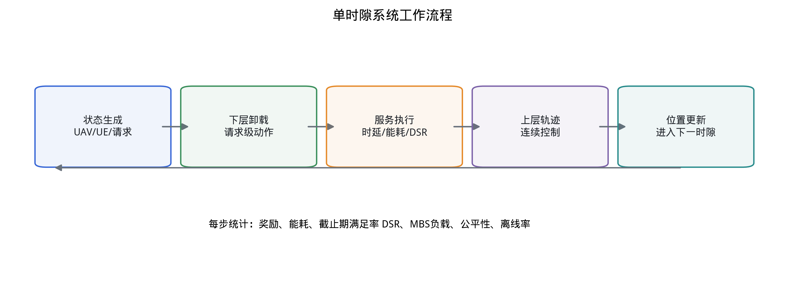
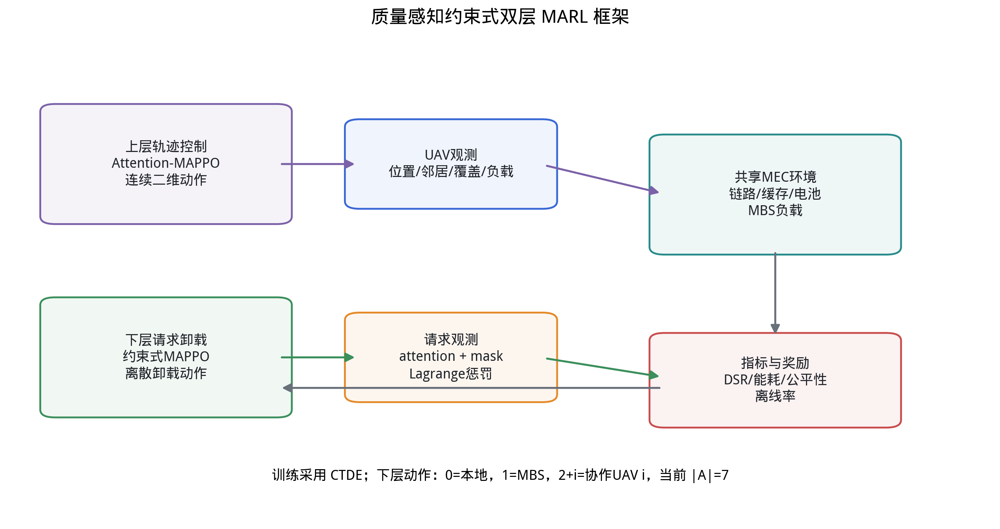
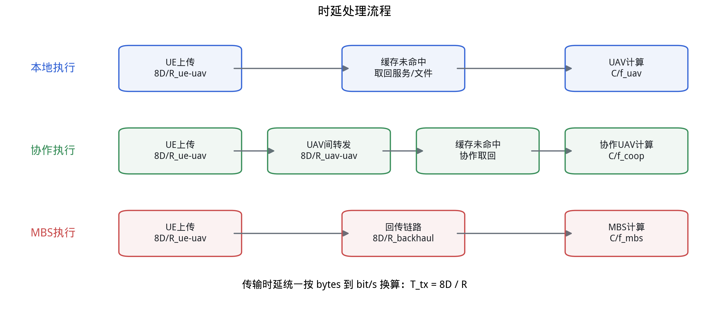
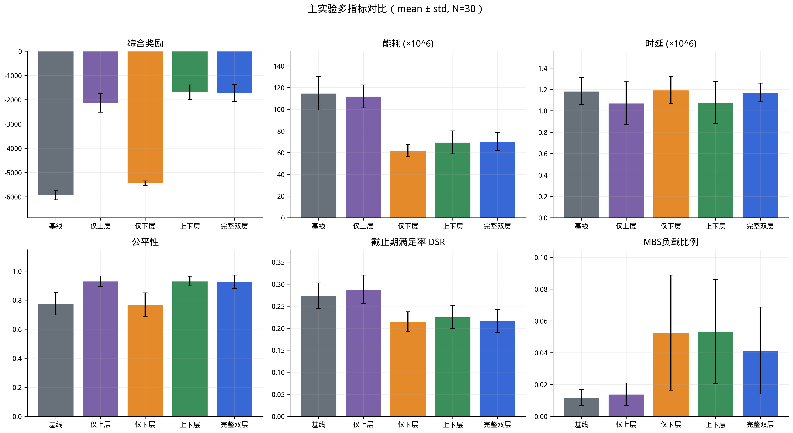
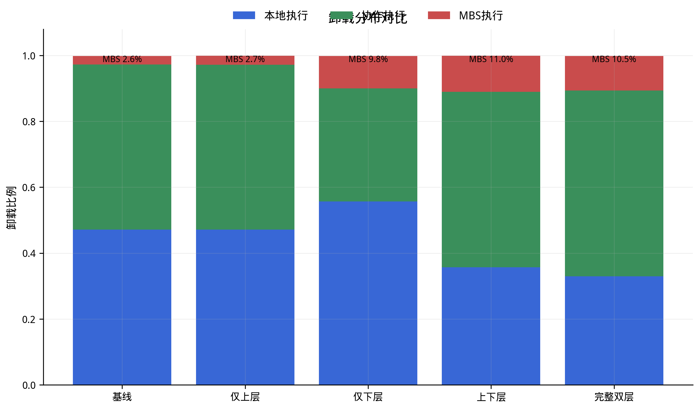
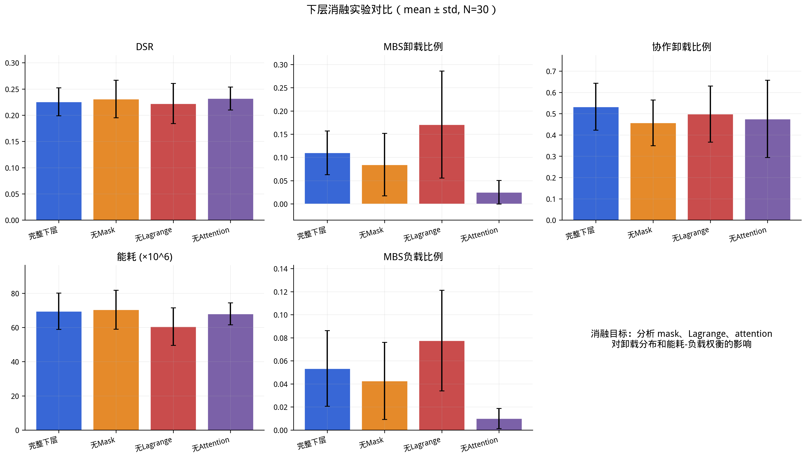
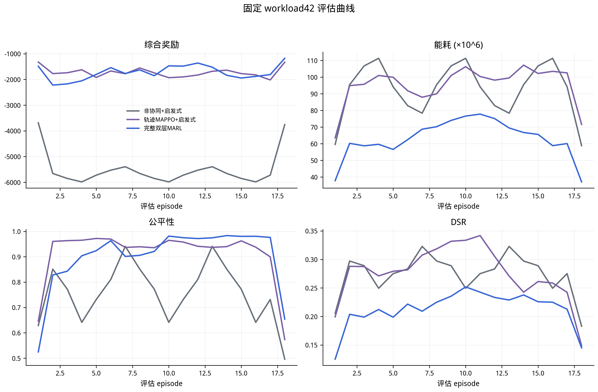
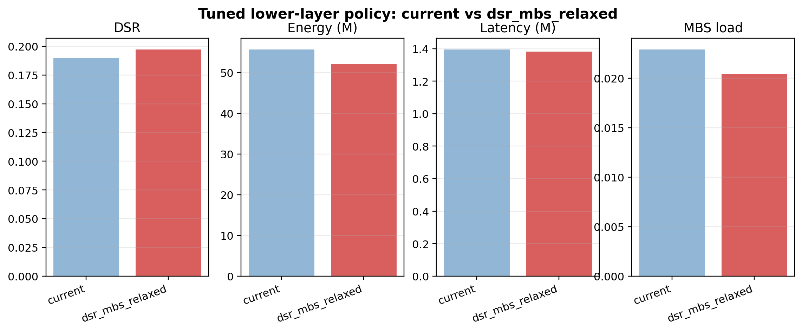

# 面向多无人机移动边缘计算的质量感知约束式双层多智能体强化学习方法

PengYanghan

## 摘要

多无人机辅助移动边缘计算能够通过空中节点的机动部署提升边缘覆盖、任务接入和协同计算能力，但系统性能同时受到无人机轨迹、无线链路状态、请求级卸载决策、截止期约束和宏基站回传负载的共同影响。若将无人机连续轨迹控制与多请求离散卸载决策直接合并为单一联合动作空间，训练复杂度和在线决策开销都会迅速上升。为此，本文提出一种面向多无人机移动边缘计算的质量感知约束式双层多智能体强化学习框架。该框架将协同调度拆分为上层轨迹控制和下层请求级卸载两个决策层：上层采用 attention-MAPPO 建模无人机之间的协同关系并输出轨迹动作；下层采用 constrained attention offload MAPPO，在每个有效服务请求上选择本地无人机执行、协作无人机执行或宏基站执行。为提升服务质量和动作可行性，本文进一步设计质量感知动作 mask，用于屏蔽明显不可行的协作与宏基站动作，并在下层奖励中引入 Lagrange 约束项，以刻画截止期满足率与宏基站负载之间的权衡。实验基于 5 架 UAV、100 个用户设备和 10 组 workload seeds 的多种随机场景展开。结果表明，完整双层 MARL 相比 uncoordinated greedy + heuristic 基线可将平均 reward 从 -1959.93 提升到 -1822.17，并将 UAV 侧能耗从 72.65M 降至 51.78M，同时公平性由 0.7582 提升至 0.8554。消融实验表明，Lagrange、质量 mask 和 attention 模块会显著改变卸载分布与能耗/负载权衡，为多无人机 MEC 中的轨迹控制与任务卸载协同优化提供了一种可复现、可分析的学习式调度范式。

**关键词：** 多无人机；移动边缘计算；任务卸载；多智能体强化学习；MAPPO；质量感知约束

## 1 引言

随着车联网、智慧城市和低空智能网络的发展，大量终端设备需要在动态环境中持续产生计算密集型或时延敏感型任务。传统地面边缘节点虽然能够在一定程度上缓解终端算力不足的问题，但在临时热点、灾害场景、覆盖盲区或高密度接入场景下，固定基础设施的覆盖范围和部署灵活性仍然有限。无人机具有机动部署、视距链路和按需覆盖等优势，因此被广泛用于增强移动边缘计算系统的通信和计算能力。

在多无人机 MEC 系统中，服务质量并不只由单一因素决定。无人机轨迹会影响 UE-UAV 链路速率、协作无人机可达性、UAV-MBS 回传质量以及区域覆盖公平性；请求卸载策略则会进一步决定任务时延、UAV 计算负载、UAV 侧能耗、宏基站负载和截止期满足率。因此，轨迹控制和任务卸载之间存在强耦合关系。若只优化轨迹，系统可能获得较好的覆盖，却仍然将大量请求回退到 MBS；若只优化卸载，策略只能被动适应当前 UAV 分布，无法主动创造更好的协作机会。

已有研究已经从凸优化、启发式算法、深度强化学习和多智能体强化学习等角度讨论 UAV-MEC 中的轨迹、卸载、资源分配、服务放置和缓存联合优化问题。近期 IEEE Internet of Things Journal 的多智能体层次调度工作也采用异构 UAV 架构，将观测 UAV、转发 UAV 和 MEC 服务器组织为多层任务调度系统，并使用 CTDE 框架优化任务传输与负载均衡。与这类工作相似，本文同样关注 UAV 辅助网络中的层次化学习调度；不同之处在于，本文不采用固定异构 OU/RU 分工，而是在同一组 UAV 上同时考虑轨迹控制与请求级卸载决策，并将系统拆解为上层连续轨迹策略与下层离散卸载策略，从而降低动作空间规模并提高方法可解释性。

本文的主要贡献如下。

1. 提出一种质量感知约束式双层 MARL 框架，将多 UAV MEC 中的轨迹控制和请求级卸载拆分为上层 attention-MAPPO 和下层 constrained attention offload MAPPO 两个协同决策层。
2. 设计请求级质量感知动作 mask，在保留空请求 slot 安全保护的基础上，对明显不可行或明显劣质的 cooperative UAV 与 MBS 动作进行运行时屏蔽，减少无效探索。
3. 在下层奖励中引入 Lagrange 约束机制，将 deadline satisfaction rate 和 MBS load ratio 纳入可解释的约束权衡。
4. 基于 training seed 与 workload seed 的成对统计单元，对上层贡献、下层贡献、完整双层 MARL 和下层消融进行系统实验，并报告均值、置信区间、paired t-test 和 Wilcoxon 检验。

图 1 给出了本文系统工作流程。当前时刻环境首先生成 UAV、UE 与请求状态；下层策略读取请求级观测与动作 mask，输出卸载动作；环境执行服务处理并统计时延、能耗、DSR 和 MBS load；随后上层策略输出 UAV 轨迹动作并更新下一时刻位置。

## 2 相关工作

### 2.1 UAV-MEC 任务卸载与轨迹优化

UAV-MEC 研究通常围绕轨迹控制、任务卸载、计算资源分配和通信资源分配展开。传统优化方法常将非凸问题分解为若干子问题，并使用连续凸近似、交替优化或匹配算法求解。这类方法在静态或准静态场景中具有较好的解释性，但在用户分布、任务到达和链路状态快速变化时，重新求解的成本较高，对实时调度不够友好。

深度强化学习为动态 UAV-MEC 调度提供了另一条路径。单智能体 DRL 可以将环境状态映射到轨迹或卸载动作，但在多 UAV 场景中，系统状态维度、动作组合和智能体间耦合关系迅速扩大，集中式单策略容易出现训练不稳定和决策延迟过高的问题。因此，多智能体强化学习逐渐成为多 UAV 协同调度的重要工具。

### 2.2 多智能体强化学习与层次化调度

多智能体强化学习可以让多个 UAV 或网络节点分别作为智能体，在集中训练、分散执行框架下学习协同策略。MAPPO 由于训练稳定、实现简洁，已被广泛用于协作控制问题。对于 UAV 辅助网络，attention 机制能够刻画 UAV 间相对重要性、邻居关系和任务负载差异，适合用于共享 critic 或 agent-level 编码。

层次化调度的核心思想是将复杂系统拆分为多个时间尺度或多个决策层。参考论文中的 MAHHV 方法针对异构 UAV-enabled vehicular network 设计了观测 UAV 和中继 UAV 的层次调度机制，并将任务接收与转发建模为多智能体 DRL 问题。本文借鉴其“系统模型、MDP、CTDE 算法、复杂度和仿真结果”的论文组织方式，但具体研究对象调整为同构多 UAV MEC 下的轨迹-卸载双层协同。

### 2.3 本文定位

本文不声称首次联合优化 UAV 轨迹和任务卸载，而是关注如何将强耦合的轨迹-卸载问题拆成可训练、可复现、可解释的双层 MARL 框架。上层负责塑造链路和覆盖环境，下层负责在当前环境中进行请求级质量控制。该设计避免了将 UAV 连续动作和多个请求离散卸载动作拼接成高维联合动作，也便于通过主表和消融实验分别分析轨迹控制、下层学习、动作 mask 和 Lagrange 约束的贡献。

## 3 系统模型与问题描述

### 3.1 网络模型

本文考虑一个由多架 UAV、多个 UE 和一个 MBS 构成的 UAV-enabled MEC 系统。UAV 在固定高度飞行，并在水平二维区域内移动，为 UE 提供通信接入、能量服务、内容传输和边缘计算服务。MBS 作为远端稳定计算节点，可在 UAV 本地或 UAV 间协作不足时提供 fallback execution，但其过度使用会造成回传压力和系统负载集中。

系统主要链路包括 UE-UAV 链路、UAV-UAV 协作链路和 UAV-MBS 回传链路。UAV 位置决定 UE 接入速率、邻居 UAV 可达性和 MBS 回传质量；请求卸载动作则决定每个服务请求最终由本地 UAV、协作 UAV 或 MBS 执行。

图 2 展示了本文的层次化 MARL 框架。上层 UAV agent 进行轨迹控制，下层 offload agent 针对请求 slot 进行离散卸载决策。两层策略共享同一环境反馈，但优化目标和动作空间不同。

### 3.2 请求模型

系统包含三类请求：服务计算请求、内容请求和能量请求。本文论文主线聚焦于服务计算请求的请求级卸载。对于服务请求，UE 产生输入数据、计算量和 deadline，UAV 需要决定该请求由本地 UAV、协作 UAV 或 MBS 执行。

设请求输入大小为 \(D\) bytes，所需 CPU cycles 为 \(C\)，链路速率为 \(R\) bit/s。由于代码中请求大小和文件大小以 bytes 存储，而无线链路速率以 bit/s 表示，传输时延统一计算为

\[
T^{\mathrm{tx}} = \frac{8D}{R}.
\]

若请求在本地 UAV 执行，总时延包括 UE-UAV 上传和 UAV 计算时延；若请求由协作 UAV 执行，总时延还包括 UAV-UAV 转发和协作 UAV 计算时延；若请求由 MBS 执行，总时延包括 UE-UAV 上传、UAV-MBS 回传和 MBS 计算时延。

图 3 给出了本文采用的时延组成。MBS 动作表示 MBS execution，而不是简单丢弃请求；其时延显式包含上传、回传和固定 MBS 算力下的计算过程。

### 3.3 优化目标

本文目标是在动态任务到达和无线链路变化下，联合提升系统级服务质量。核心指标包括平均 reward、任务时延、UAV 侧能耗、deadline satisfaction rate、服务公平性、offline rate、MBS offloading ratio 和 MBS load ratio。形式上，可将系统目标表示为

\[
\max_{\pi^{\mathrm{upper}}, \pi^{\mathrm{lower}}}
\mathbb{E}\left[\sum_{t=0}^{T-1}\gamma^t r_t\right],
\]

其中 \(\pi^{\mathrm{upper}}\) 为上层轨迹策略，\(\pi^{\mathrm{lower}}\) 为下层卸载策略，\(r_t\) 同时考虑时延、能耗、服务完成、截止期满足、协作收益和负载约束。与单一端到端策略不同，本文将该优化拆成两个可学习子问题，使每一层都拥有明确动作语义和可分析指标。

## 4 质量感知约束式双层 MARL 方法

### 4.1 双层决策流程

在每个环境 step 中，系统按如下顺序执行。

1. 环境生成当前 UAV、UE、链路和请求状态。
2. 下层调用请求级观测接口，获得每架 UAV 的服务请求 slot 和对应动作 mask。
3. 下层 MAPPO 对每个有效请求 slot 输出卸载动作。
4. 环境执行服务请求处理，并统计 latency、energy、DSR、MBS load 等指标。
5. 上层 attention-MAPPO 输出 UAV 轨迹动作，环境更新 UAV 位置并进入下一时刻。

这种流程使下层先在当前物理拓扑中做请求处理，上层再改变下一步服务环境。与直接联合动作建模相比，该结构显著降低了单步动作维度，也使轨迹贡献和卸载贡献可以在实验中分离分析。

### 4.2 上层 attention-MAPPO 轨迹控制

上层将每架 UAV 作为一个 agent。每个 agent 根据自身位置、邻居 UAV 状态、覆盖 UE 和请求负载信息输出轨迹动作。attention 模块用于刻画 UAV 间关系，使策略能够根据邻居状态、负载分布和覆盖情况调整运动方向。

上层主要作用并非直接决定任务执行节点，而是塑造下一时刻的服务环境：改善 UE-UAV 链路，增加可用协作邻居，提升区域公平性，并影响 MBS fallback 的必要性。实验中，上层基线采用 uncoordinated greedy，上层主方法采用 attention-MAPPO。

### 4.3 下层 constrained attention offload MAPPO

下层同样采用多智能体建模。每架 UAV 是一个 lower-layer agent，处理其当前关联的 bounded request slots。每个有效请求 slot 的离散动作空间为

| 动作编号 | 动作含义 |
| ---: | --- |
| 0 | local UAV execution |
| 1 | cooperative UAV execution |
| 2 | MBS execution |

其中 cooperative 动作表示选择“协作类别”，具体协作 UAV 由运行时可用性和最小时延规则解析。下层 actor 使用 request attention 编码同一 UAV 内多个请求的相对重要性；critic 采用集中式信息估计 value，以保持 CTDE 训练框架下的稳定性。

下层奖励包含服务完成、deadline satisfaction、latency、energy、MBS load 和 cooperative bonus。为了显式控制约束，本文引入 Lagrange 乘子 \(\lambda_{\mathrm{dsr}}\) 和 \(\lambda_{\mathrm{mbs}}\)，分别对应 DSR 下界和 MBS load 上界。约束惩罚可写为

\[
P_t = \lambda_{\mathrm{dsr}}\max(0, \tau_{\mathrm{dsr}}-\mathrm{DSR}_t)
      + \lambda_{\mathrm{mbs}}\max(0, \mathrm{MBSLoad}_t-\tau_{\mathrm{mbs}}).
\]

最终下层优化的即时奖励为基础质量奖励减去约束惩罚。该设计使下层策略不仅追求单请求即时收益，也能够反映系统层面的服务质量和 MBS 负载控制。

### 4.4 质量感知动作 mask

请求级动作 mask 用于减少明显无效的探索。本文保留两类 mask。

第一类是空请求 slot mask。若某个 slot 没有真实服务请求，则该 slot 不产生真实卸载动作。这个保护在所有实验中始终开启，即使在 no-mask 消融中也保留。

第二类是质量感知 mask。对于 cooperative 动作，当系统不存在可用邻居、协作路径时延过高、协作相对非协作路径无明显优势或协作计算份额过低时，屏蔽 cooperative 动作。对于 MBS 动作，当 MBS 路径时延明显超过 deadline clip 阈值时，屏蔽 MBS 动作。该机制不是用 oracle 直接替代策略，而是在动作空间层面排除显著劣质选择。

### 4.5 复杂度分析

设 UAV 数量为 \(N\)，每架 UAV 的最大请求 slot 数为 \(K\)，下层动作数为 \(A=3\)。若直接构建联合动作空间，单步离散卸载组合可能达到 \(A^{NK}\)，并且还需与连续轨迹动作耦合。本文采用双层分解后，上层只处理 \(N\) 个 UAV 的轨迹动作，下层只在每个 UAV 的 \(K\) 个请求 slot 上进行局部离散决策。attention 编码带来的主要额外开销为 UAV 间或请求间关系建模，通常可表示为 \(O(N^2)\) 或 \(O(K^2)\)，远小于端到端枚举式联合动作空间。

## 5 实验设计

### 5.1 仿真设置

实验区域为 \(700\,\mathrm{m} \times 700\,\mathrm{m}\)，系统包含 5 架 UAV、100 个 UE 和 1 个 MBS。每个 episode 包含 1000 个 time slots，每个 time slot 时长为 1 s。UAV 飞行高度为 100 m，最大速度为 15 m/s，覆盖半径为 100 m，感知范围为 460 m，最小 UAV 间距为 200 m。系统包含 25 类服务和 50 类内容文件，服务 deadline 在 \([0.65,2.10]\) s 范围内生成。MBS 固定算力为 \(200\times10^9\) cycles/s。

正式实验采用 3 个 training seeds：42、84、126，以及 10 个 workload seeds：42、84、126、168、210、252、294、336、378、420。每个 workload seed 运行 6 个 episodes。统计单元为 \((\mathrm{training\ seed}, \mathrm{workload\ seed})\) 的 episode mean，因此每个策略共有 \(N=30\) 个统计样本。本文报告 mean、std、95% CI、相对参考组的 paired delta、paired t-test 和 Wilcoxon 检验。

### 5.2 对比方法

主实验比较五组策略组合。

| 组合方案 | 轨迹控制 | 卸载策略 | 角色 |
| --- | --- | --- | --- |
| uncoordinated_greedy__heuristic | uncoordinated greedy | heuristic | 基础参考 |
| attention_mappo__heuristic | attention-MAPPO | heuristic | 上层贡献 |
| uncoordinated_greedy__lower_mappo | uncoordinated greedy | lower MAPPO | 下层贡献 |
| attention_mappo__lower_mappo | attention-MAPPO | lower MAPPO | 分别训练组合 |
| full_hierarchical_marl | attention-MAPPO | lower MAPPO | 完整双层主方法 |

下层消融以 lower_full 为参考，比较 no_mask、no_lagrange 和 no_attention 三种变体。

| 消融方法 | Attention | Quality mask | Lagrange |
| --- | --- | --- | --- |
| lower_full | yes | yes | yes |
| lower_no_mask | yes | no | yes |
| lower_no_lagrange | yes | yes | no |
| lower_no_attention | no | yes | yes |

## 6 实验结果与分析

### 6.1 主实验结果

图 4 展示了主实验中不同策略组合的核心指标对比。表 1 汇总了各策略的均值和 95% 置信区间。

| 策略 | Reward | Latency | Energy | Fairness | DSR | MBS load |
| --- | ---: | ---: | ---: | ---: | ---: | ---: |
| uncoordinated_greedy__heuristic | -1959.93 [-1996.49, -1923.36] | 1155548.68 | 72.65M | 0.7582 | 0.2094 | 0.0067 |
| attention_mappo__heuristic | -1911.57 [-1938.11, -1885.03] | 1391323.46 | 64.14M | 0.8842 | 0.2071 | 0.0069 |
| uncoordinated_greedy__lower_mappo | -1954.75 [-1992.29, -1917.20] | 1157370.66 | 66.39M | 0.7546 | 0.1898 | 0.0318 |
| attention_mappo__lower_mappo | -1897.90 [-1924.07, -1871.72] | 1383137.07 | 47.31M | 0.8833 | 0.1838 | 0.0307 |
| full_hierarchical_marl | -1822.17 [-1863.20, -1781.14] | 1378620.32 | 51.78M | 0.8554 | 0.1759 | 0.0274 |

相对基础参考 uncoordinated_greedy__heuristic，完整双层 MARL 的 reward 提升 137.8，95% CI 为 [84.37, 191.1]，paired t-test 的 \(p=1.174\times10^{-5}\)。UAV 侧能耗降低 20.86M，95% CI 为 [-25.86M, -15.87M]，\(p=2.068\times10^{-9}\)。公平性提升 0.0972，95% CI 为 [0.0613, 0.1331]，\(p=5.699\times10^{-6}\)。这些结果说明，双层策略能够显著改善综合 reward、能耗和覆盖公平性。

同时，主实验也暴露出一个重要权衡：完整双层 MARL 的平均 latency 和 offline rate 相比基础参考上升，DSR 从 0.2094 降至 0.1759，MBS load ratio 从 0.0067 升至 0.0274。这表明当前 reward 权重和约束设置更偏向能耗与整体 reward 改善，而 DSR 和 MBS 负载仍需要进一步调参。该结果并不削弱双层框架本身的价值，反而说明本文方法提供了一个可解释的调度平台，可以通过 Lagrange 阈值和奖励权重调整服务质量与负载之间的平衡。

### 6.2 卸载分布分析

图 5 展示了各策略的 local、cooperative 和 MBS 卸载比例。heuristic 基线主要依赖 local 和 cooperative，MBS ratio 约为 0.0189；lower MAPPO 系列显著提高了 learned decision count，但也更频繁使用 MBS。完整双层 MARL 的 MBS ratio 为 0.0865，低于 attention_mappo__lower_mappo 的 0.0933，同时 cooperative ratio 从 0.2230 提升至 0.2892，说明 full hierarchical 训练能够在一定程度上把请求从 MBS 拉回 UAV 协作路径。

### 6.3 下层消融结果

图 6 和表 2 给出了下层消融实验结果。

| 策略 | Reward | Latency | Energy | Fairness | DSR | MBS load |
| --- | ---: | ---: | ---: | ---: | ---: | ---: |
| lower_full | -1897.90 | 1383137.07 | 47.31M | 0.8833 | 0.1838 | 0.0307 |
| lower_no_mask | -1892.49 | 1388195.84 | 51.89M | 0.8793 | 0.1874 | 0.0191 |
| lower_no_lagrange | -1905.13 | 1383135.72 | 57.45M | 0.8876 | 0.1911 | 0.0267 |
| lower_no_attention | -1901.96 | 1388153.65 | 52.45M | 0.8762 | 0.1989 | 0.0162 |

相对 lower_full，lower_no_lagrange 的 energy 增加 10.14M，paired t-test 的 \(p=1.997\times10^{-5}\)，说明 Lagrange 约束对能耗和卸载分布具有显著影响。lower_no_attention 的 DSR 提升 0.0150，同时 MBS load 降低 0.0145，但 reward 和能耗均略有回退，说明 attention 模块并非单调提升所有指标，而是改变了策略在多请求 slot 下的分配偏好。lower_no_mask 的多数指标差异不显著，但 MBS load 有下降趋势，说明当前质量 mask 的阈值仍有进一步校准空间。

### 6.4 训练过程与 DSR-MBS 权衡

图 7 给出了层次化训练曲线。训练过程中 reward、actor loss、critic loss、entropy 和约束乘子共同反映了策略收敛与探索变化。由于下层策略同时面临服务完成、时延、能耗和 MBS 负载等多目标，单一 reward 曲线并不足以解释最终策略，需要结合 DSR、MBS load 和卸载分布共同分析。

图 8 展示了 DSR 和 MBS load 的权衡实验。结果说明，当约束阈值或奖励权重更重视 DSR 时，策略往往更愿意调用 MBS 或协作路径以提高完成概率；当系统更强调 MBS 减负时，策略会倾向 local 或 cooperative，但可能牺牲一部分 deadline satisfaction。该现象与本文引入 Lagrange 约束的动机一致：多 UAV MEC 调度不是单目标最优问题，而是服务质量、能耗和基础设施负载之间的可调平衡。

## 7 讨论

本文实验给出三个层面的结论。第一，上层 attention-MAPPO 能够显著改善 reward、UAV 侧能耗和公平性，但单独替换上层并不能保证 DSR 提升。第二，下层 lower MAPPO 能够真正接管服务请求决策，service learned decision count 大于 0 且 fallback count 为 0，说明学习式卸载链路已经正常运行。第三，完整双层 MARL 在综合 reward 和能耗上表现最好，但 DSR 与 MBS load 仍存在调参空间。

因此，本文方法更适合作为一个可扩展的研究框架，而不是一次性固定权重下的最终闭式最优解。后续可以继续从三方面改进：其一，调节 DSR 与 MBS load 约束阈值，提升服务截止期表现；其二，引入更强的下层 credit assignment 或层间通信机制；其三，在更复杂的移动 UE、动态热点和多 MBS 场景中验证泛化性。

## 8 结论

本文针对多无人机移动边缘计算中的轨迹控制与请求级任务卸载耦合问题，提出了一种质量感知约束式双层 MARL 方法。该方法采用上层 attention-MAPPO 控制 UAV 轨迹，下层 constrained attention offload MAPPO 处理 local、cooperative 和 MBS 三类卸载动作，并通过质量感知动作 mask 与 Lagrange 约束刻画服务质量和宏基站负载之间的权衡。实验结果表明，完整双层 MARL 在 reward、UAV 侧能耗和公平性上显著优于 uncoordinated greedy + heuristic 基线；消融实验进一步揭示了 Lagrange、attention 和 quality mask 对卸载分布及能耗/负载权衡的影响。未来工作将进一步优化约束权重，扩展到更大规模 UAV-MEC 场景，并研究更紧密的上下层联合训练机制。

## 参考文献

[1] T. Du, X. Gui, and T. Sheng, “Multiagent Deep Reinforcement Learning-Based Hierarchical Scheduling in Heterogeneous UAV-Enabled Vehicular Networks,” *IEEE Internet of Things Journal*, vol. 12, no. 24, pp. 54938-54954, Dec. 2025.

[2] J. Schulman, F. Wolski, P. Dhariwal, A. Radford, and O. Klimov, “Proximal Policy Optimization Algorithms,” arXiv:1707.06347, 2017.

[3] C. Yu et al., “The Surprising Effectiveness of PPO in Cooperative Multi-Agent Games,” arXiv:2103.01955, 2021.

[4] Y. Zeng, R. Zhang, and T. J. Lim, “Wireless Communications with Unmanned Aerial Vehicles: Opportunities and Challenges,” *IEEE Communications Magazine*, vol. 54, no. 5, pp. 36-42, 2016.

[5] N. Abbas, Y. Zhang, A. Taherkordi, and T. Skeie, “Mobile Edge Computing: A Survey,” *IEEE Internet of Things Journal*, vol. 5, no. 1, pp. 450-465, 2018.

[6] S. Liu, Y. Yu, X. Qu, and Y. Tang, “Distributed Multi-Agent Deep Reinforcement Learning for Resource Allocation in UAV Networks,” *IEEE Internet of Things Journal*, vol. 9, no. 9, pp. 6914-6927, 2022.

