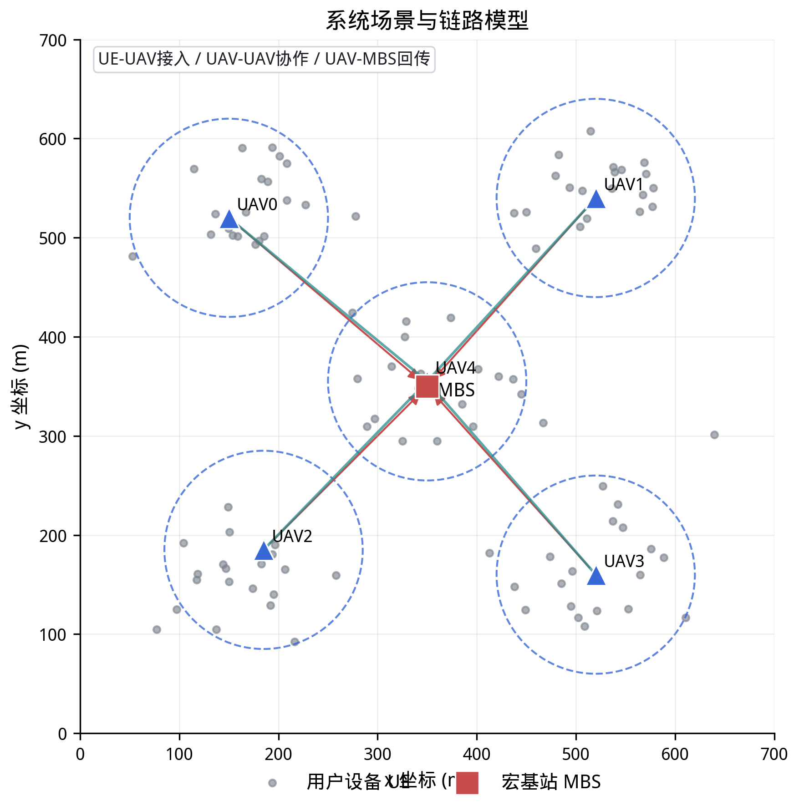
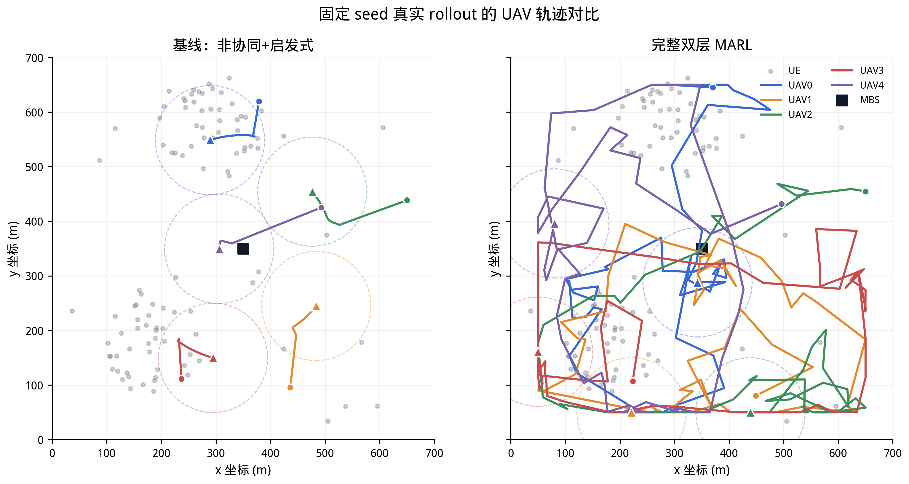
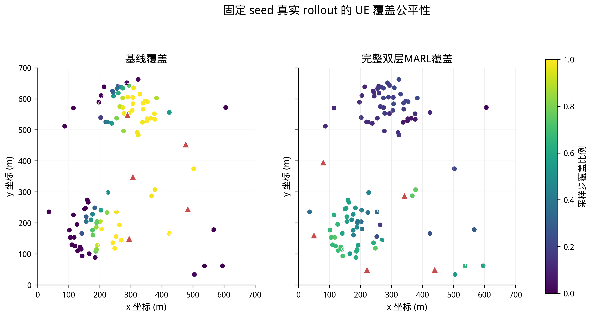
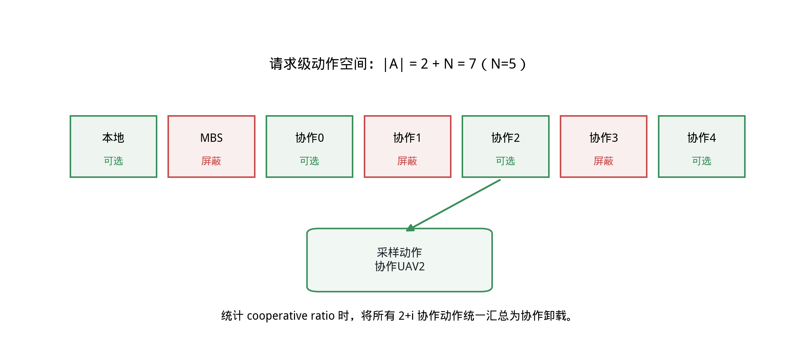
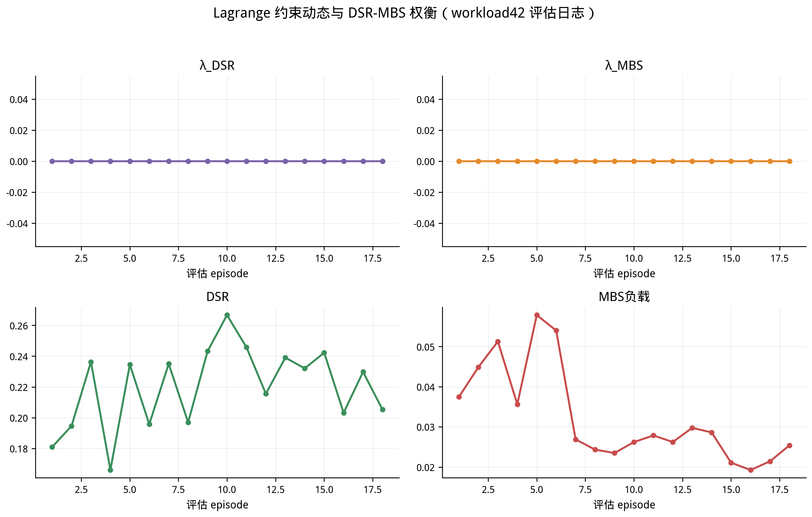

# 面向多无人机移动边缘计算的质量感知约束式双层多智能体强化学习方法

**Quality-aware Constrained Hierarchical Multi-Agent Reinforcement Learning for Multi-UAV Mobile Edge Computing**

## 摘要

多无人机辅助移动边缘计算能够通过空中节点的机动部署提升边缘覆盖、任务接入和协同计算能力，但系统性能同时受到无人机轨迹、无线链路状态、请求级卸载决策、截止期约束和宏基站回传负载的共同影响。若将无人机连续轨迹控制与多请求离散卸载决策直接合并为单一联合动作空间，训练复杂度和在线决策开销都会迅速上升。为此，本文提出一种面向多无人机移动边缘计算的质量感知约束式双层多智能体强化学习框架。该框架将协同调度拆分为上层轨迹控制和下层请求级卸载两个决策层：上层采用 attention-MAPPO 建模无人机之间的协同关系并输出轨迹动作；下层采用 constrained attention offload MAPPO，在每个有效服务请求上选择本地无人机执行、协作无人机执行或宏基站执行。本文进一步设计质量感知动作 mask 屏蔽明显不可行的协作与宏基站动作，并在下层奖励中引入 Lagrange 约束项刻画截止期满足率与宏基站负载之间的权衡。同时，本文在系统模型中显式建模无人机飞行能耗 $E_{fly} = P_{move} \cdot t_{moving} + P_{hover} \cdot t_{hovering}$ 和用户设备电池动态 $B_{t+1} = \min(B_{max}, B_t - E_{static} - E_{tx} - E_{rx} + E_{harv})$，并通过无线能量传输机制维持终端设备在线。实验基于 5 架 UAV、100 个用户设备、3 个 training seeds 和 10 组 workload seeds 展开。结果表明，完整双层 MARL 相比 uncoordinated greedy + heuristic 基线可将平均 reward 从 -5933.9 提升到 -1451.7（$\Delta = +4482.2$, $p = 1.0\times10^{-32}$），UAV 侧能耗从 114.70M 降至 58.06M（$\Delta = -56.64M$, $p = 1.7\times10^{-19}$），公平性由 0.7745 提升至 0.9363（$\Delta = +0.162$, $p = 1.7\times10^{-11}$），offline rate 由 0.58% 降至 0.00%。同时，当前权重配置下完整方法的 DSR 从 0.2734 降至 0.2083（$\Delta=-0.0651$, $p=2.4\times10^{-11}$），说明该配置更偏向能耗、公平性和在线率收益，而非单独最大化截止期满足率。仅替换上层轨迹策略（attention-MAPPO + heuristic）时，DSR 从 0.2734 提升至 0.2879，表明 DSR 下降主要来自下层学习式卸载策略对能耗与负载分布的重新权衡。消融实验表明，Lagrange 约束、质量 mask 和 attention 模块会显著改变卸载分布与能耗/负载权衡。进一步通过调整 reward 权重与 Lagrange 约束阈值的 DSR-aware 配置，完整方法的 DSR 可从 0.2083 提升至 0.2435（$\Delta$ 相对基线从 -0.065 缩小至 -0.030），同时保持 28% 的能耗节省，验证了该框架在不同服务质量偏好下的可调节性。

**关键词：** 多无人机；移动边缘计算；任务卸载；多智能体强化学习；MAPPO；双层优化；质量感知约束；Lagrange 约束

---

## Abstract

Multi-UAV assisted mobile edge computing (MEC) enhances edge coverage, task admission, and cooperative computing through aerial node deployment, yet system performance is jointly affected by UAV trajectory, wireless link dynamics, per-request offloading decisions, deadline constraints, and macro base station (MBS) backhaul load. Directly combining continuous UAV trajectory control with discrete per-request offloading decisions into a single joint action space leads to prohibitive training complexity and online decision latency. This paper proposes a quality-aware constrained hierarchical multi-agent reinforcement learning (MARL) framework for multi-UAV MEC. The framework decomposes coordinated scheduling into an upper-layer trajectory control module and a lower-layer per-request offloading module. The upper layer employs attention-MAPPO to model inter-UAV coordination and output trajectory actions; the lower layer employs constrained attention offload MAPPO to select, for each service request, among local UAV execution, cooperative UAV execution, and MBS execution. We design a quality-aware action mask that prunes clearly infeasible cooperative and MBS actions, and introduce Lagrange constraint terms in the lower-layer reward to characterize the trade-off between deadline satisfaction rate (DSR) and MBS load ratio. Additionally, we explicitly model UAV flight energy and UE battery dynamics, maintaining terminal device availability via wireless power transfer (WPT). Experiments are conducted across 3 training seeds and 10 workload seeds on a system with 5 UAVs and 100 UEs. Results show that the full hierarchical MARL improves mean reward from -5933.9 to -1451.7 relative to the uncoordinated greedy + heuristic baseline ($\Delta = +4482.2$, $p = 1.0\times10^{-32}$), reduces UAV-side energy from 114.70M to 58.06M ($\Delta = -56.64M$, $p = 1.7\times10^{-19}$), raises fairness from 0.7745 to 0.9363 ($\Delta = +0.162$, $p = 1.7\times10^{-11}$), and lowers the offline rate from 0.58% to 0.00%. Under the current reward weights, however, DSR decreases from 0.2734 to 0.2083 ($\Delta=-0.0651$, $p=2.4\times10^{-11}$), indicating a working point that favors energy, fairness, and UE availability rather than maximizing DSR alone. In contrast, replacing only the upper-layer trajectory policy with attention-MAPPO improves DSR from 0.2734 to 0.2879, suggesting that the DSR degradation mainly comes from the lower-layer learned offloading trade-off. Ablation studies further show that the Lagrange constraint, quality mask, and attention module each independently shape the offloading distribution and energy-load trade-off. Furthermore, a DSR-aware configuration with adjusted reward weights and Lagrange constraint thresholds raises the full method's DSR from 0.2083 to 0.2435 (narrowing the gap vs. baseline from -0.065 to -0.030), while retaining 28% energy savings, demonstrating the framework's tunability across different quality-of-service preferences.

**Keywords:** Multi-UAV; mobile edge computing; task offloading; multi-agent reinforcement learning; MAPPO; hierarchical optimization; quality-aware constraints; Lagrange constraints

---

## 1 引言

### 1.1 研究背景

随着车联网、智慧城市和低空智能网络的发展，大量终端设备需要在动态环境中持续产生计算密集型或时延敏感型任务。传统地面边缘节点虽然能够在一定程度上缓解终端算力不足的问题，但在临时热点、灾害场景、覆盖盲区或高密度接入场景下，固定基础设施的覆盖范围和部署灵活性仍然有限。无人机（Unmanned Aerial Vehicle, UAV）具有机动部署、视距链路和按需覆盖等优势，因此被广泛用于增强移动边缘计算系统的通信和计算能力 [1-3]。

在多无人机 MEC 系统中，服务质量并不只由单一因素决定。无人机轨迹会影响 UE-UAV 链路速率、协作无人机可达性、UAV-MBS 回传质量以及区域覆盖公平性；请求卸载策略则会进一步决定任务时延、UAV 计算负载、UAV 侧能耗、宏基站负载和截止期满足率。因此，轨迹控制和任务卸载之间存在强耦合关系 [4,5]。若只优化轨迹，系统可能获得较好的覆盖，却仍然将大量请求回退到 MBS；若只优化卸载，策略只能被动适应当前 UAV 分布，无法主动创造更好的协作机会。

现有研究已经从凸优化 [6,7]、启发式算法 [8]、深度强化学习 [9-11] 和多智能体强化学习 [12-14] 等角度讨论了 UAV-MEC 中的轨迹、卸载、资源分配、服务放置和缓存联合优化问题。黄子祥等 [3] 针对应急场景提出基于 MADRL 的多无人机协同计算卸载策略，联合优化卸载比例、飞行角度和速度，并使用 Jain 公平性指数衡量负载均衡。尤昕阳等 [9] 提出基于柔性 Actor-Critic 的多无人机协同 MEC 任务卸载方案，联合决策任务卸载比例、无人机选择、传输功率与算力分配。王义君等 [8] 提出基于协同缓存自适应的分层多元宇宙优化算法（CCAH-MVO），在三层网络架构下协同优化缓存、卸载和资源分配。曾耀平等 [6] 采用 Stackelberg 博弈方法联合优化 UAV 部署和 UE 卸载策略。李侍阳等 [7] 面向感知与 AI 协同任务，提出基于 MILP 和 SCA 的多维资源联合优化算法。与上述工作不同，本文关注如何将强耦合的轨迹-卸载问题拆分为可训练、可复现、可解释的双层 MARL 框架，并显式建模终端设备的能量动态以维持系统的持续运行。

### 1.2 主要贡献

1. 提出一种质量感知约束式双层 MARL 框架，将多 UAV MEC 中的轨迹控制和请求级卸载拆分为上层 attention-MAPPO 和下层 constrained attention offload MAPPO 两个协同决策层，以降低直接联合建模的动作耦合复杂度。
2. 设计请求级质量感知动作 mask，对明显不可行的 cooperative UAV 与 MBS 动作进行运行时屏蔽，减少无效探索。消融实验表明，mask 会改变 MBS load ratio 和协作卸载比例。
3. 在下层奖励中引入 Lagrange 约束机制，将 DSR 和 MBS load ratio 纳入可解释的约束权衡。消融实验表明，去除 Lagrange 约束后 MBS load ratio 从 11.0% 上升至 17.1%。

此外，本文在系统模型中显式考虑 UAV 飞行能耗、UE 电池动态和 WPT 机制，并基于 training seed 与 workload seed 的成对统计单元（N=30）报告均值、95% 置信区间、paired t-test 和 Wilcoxon 检验。这些内容作为系统建模与实验规范支撑上述方法验证，不单独作为算法创新点。

### 1.3 论文组织

本文其余部分组织如下：第 2 章介绍系统模型与问题形式化；第 3 章详细描述双层 MARL 方法；第 4 章介绍实验设计；第 5 章呈现实验结果与分析；第 6 章总结全文。

---

## 2 系统模型与问题描述

### 2.1 网络模型

本文考虑一个由 $N=5$ 架 UAV、$M=100$ 个 UE 和一个 MBS 构成的 UAV-enabled MEC 系统。UAV 在固定高度 $H=100$ m 飞行，在 $700 \times 700$ m$^2$ 的水平区域内移动。MBS 作为远端稳定计算节点，可在 UAV 本地或 UAV 间协作不足时提供 fallback execution，但其过度使用会造成回传压力和系统负载集中。

系统主要链路包括 UE-UAV 链路、UAV-UAV 协作链路和 UAV-MBS 回传链路。每个时间步 $\tau = 1$s，系统包含 $T=1000$ 个 time slots。UAV 覆盖半径为 $R_c = 100$ m，最大飞行速度 $v_{max} = 15$ m/s，最小安全间距 $d_{min} = 200$ m。

**图 1 系统场景与链路模型**：展示 5 架 UAV、100 个 UE、1 个 MBS 以及 UE-UAV、UAV-UAV、UAV-MBS 三类链路和 WPT/请求要素。

### 2.2 通信模型

UE 与 UAV 之间采用自由空间路径损耗模型（Line-of-Sight, LoS），信道增益定义为：

$$g(d) = \frac{\beta_0}{d^2}$$

其中 $\beta_0$ 为参考距离 1m 时的信道功率增益，$d$ 为 UE-UAV 之间的欧氏距离。根据香农定理，UE 到 UAV 的上行传输速率为：

$$R = B \cdot \log_2\left(1 + \frac{P_{tx} \cdot g(d)}{\sigma^2}\right)$$

其中 $B$ 为信道带宽，$P_{tx}$ 为发射功率，$\sigma^2$ 为噪声功率。UAV-MBS 回传链路采用独立的带宽 $B_{backhaul}$。

**关键设计选择**：本文实现中请求大小和文件大小以 bytes 记录，而无线链路速率以 bit/s 表示，因此所有传输时延统一写为：

$$T_{tx} = \frac{8 \cdot D}{R}$$

其中 $D$ 为数据量（bytes），$R$ 为链路速率（bit/s）。此 8× 因子确保了 bytes 到 bit/s 的正确单位转换。

### 2.3 计算模型

#### 2.3.1 时延模型

对于每个服务请求，其时延取决于卸载目标：

**本地 UAV 执行**：
$$T_{local} = T_{tx}^{ue-uav} + T_{fetch}^{local} + T_{comp}^{uav}
= \frac{8D_{in}}{R_{ue-uav}} + T_{fetch}^{local} + \frac{C}{f_{uav}}$$

**协作 UAV 执行**：
$$T_{coop} = \frac{8D_{in}}{R_{ue-uav}} + \frac{8D_{in}}{R_{uav-uav}} + T_{fetch}^{coop} + \frac{C}{f_{coop}}$$

**MBS 执行**：
$$T_{mbs} = \frac{8D_{in}}{R_{ue-uav}} + \frac{8D_{in}}{R_{backhaul}} + \frac{C}{f_{mbs}}$$

其中 $C$ 为所需 CPU 周期数（cycles），$f_{uav}$ 和 $f_{mbs}$ 分别为 UAV 和 MBS 的计算能力（cycles/s）。当本地 UAV 或协作 UAV 未缓存对应服务/文件时，$T_{fetch}^{local}$ 或 $T_{fetch}^{coop}$ 表示从 MBS 回传获取服务/文件产生的额外时延；缓存命中时该项为 0。MBS 固定算力为 $f_{mbs} = 200 \times 10^9$ cycles/s。

**图 2 时延处理流程**：展示本地执行、协作执行和 MBS 执行三条路径的时延组成，包含 $T_{tx}=8D/R$、缓存未命中取回和计算时延。

#### 2.3.2 UAV 计算能耗

本文采用 CMOS 动态功耗模型进行计算能耗估计：

$$E_{comp} = K_{cpu} \cdot C \cdot f^2$$

其中 $K_{cpu} = 10^{-27}$ 为 CPU 电容系数。每架 UAV 的计算能力 $f_{uav}$ 在 $40 \times 10^9$ 至 $90 \times 10^9$ cycles/s 之间随机生成。

#### 2.3.3 通信能耗

通信能耗由发射/接收功率与传输时长决定：

$$E_{comm} = P_{comm} \cdot T_{tx}$$

不同链路的功率取值不同：UE 发射功率 $P_{ue} = 0.5$W，UAV 通信发射/接收功率分别为 0.5W/0.1W，UAV-MBS 回传发射功率 0.5W。

### 2.4 UE 电池与无线能量传输模型

#### 2.4.1 UE 电池模型

每个 UE 配备容量为 $B_{max} = 500$J 的电池。每个时间步的电池动态为：

$$B_{t+1} = \min\left(B_{max}, \; B_t - E_{static} - E_{tx} \cdot \mathbb{1}[\text{transmit}] - E_{rx} \cdot \mathbb{1}[\text{receive}] + E_{harv}\right)$$

其中 $E_{static} = P_{static} \cdot \tau = 0.01$W $\times 1$s $= 0.01$J 为待机能耗，$E_{tx} = P_{ue} \cdot T_{tx}$ 为发射能耗，$E_{rx}$ 为 UE 接收内容或结果时产生的接收能耗。当 UE 电池低于临界阈值 $B_{low} = 0.1 \times B_{max} = 50$J 时，UE 进入 offline 状态，不再生成服务请求，转而生成紧急能量请求。

系统 offline rate 定义为：

$$O = \frac{|\{ue \mid B_{ue} < B_{low}\}|}{M}$$

#### 2.4.2 无线能量传输（WPT）

UAV 可通过 WPT 为覆盖范围内的 UE 进行无线充电。单个 UE 在单个时间步可采集的能量为：

$$E_{harv} = \eta \cdot P_{wpt} \cdot G \cdot g(d) \cdot \tau$$

其中 $\eta = 0.8$ 为能量采集效率，$P_{wpt} = 50$W 为 UAV 的 WPT 发射功率，$G = 5\times10^5$ 为等效采集增益，$g(d) = \beta_0/d^2$ 为信道增益。

### 2.5 UAV 飞行能耗模型

UAV 在每个时间步的飞行能耗取决于实际飞行距离：

$$E_{fly} = P_{move} \cdot t_{moving} + P_{hover} \cdot t_{hovering}$$

$$t_{moving} = \frac{d_{moved}}{v_{max}}, \quad t_{hovering} = \tau - t_{moving}$$

其中 $P_{move} = 300$W 为飞行功率，$P_{hover} = 150$W 为悬停功率，$d_{moved}$ 为 UAV 在上一时间步的飞行距离（受 MARL 上层动作控制）。全速飞行（$d_{moved} = 15$m）时 $E_{fly} = 300 \times 1 = 300$J，悬停时 $E_{fly} = 150 \times 1 = 150$J。

UAV 侧总能耗（单步）为：

$$E_{total} = \sum_{u=1}^{N} \left(E_{fly}^{(u)} + E_{comp}^{(u)} + E_{comm}^{(u)} + E_{wpt}^{(u)}\right)$$

其中 $E_{wpt}^{(u)} = P_{wpt} \cdot \tau \cdot \mathbb{1}[\text{has energy request}]$ 为 WPT 发射能耗。

### 2.6 优化目标

本文目标是在动态任务到达和无线链路变化下，联合优化 UAV 轨迹和请求卸载策略，以最大化系统级综合奖励。优化问题可形式化为：

$$\max_{\pi^{upper}, \pi^{lower}} \mathbb{E}\left[\sum_{t=0}^{T-1} \gamma^t R_t\right]$$

其中系统奖励 $R_t$ 为：

$$R_t = \alpha_J \cdot J_t - \alpha_L \cdot \bar{L}_t - \alpha_E \cdot \bar{E}_t - \alpha_O \cdot O_t + \alpha_D \cdot DSR_t - \alpha_M \cdot M_t$$

式中各项含义：
- $J_t \in [0,1]$：Jain 公平性指数
- $\bar{L}_t$：归一化时延（除以 $M \cdot T_{penalty}$）
- $\bar{E}_t$：归一化能耗（除以 $N \cdot E_{ref}$）
- $O_t \in [0,1]$：UE offline rate
- $DSR_t \in [0,1]$：deadline satisfaction rate
- $M_t \in [0,1]$：MBS load ratio，即卸载至 MBS 的服务请求比例

权重设置为：$\alpha_J = 1.0$, $\alpha_L = 1.0$, $\alpha_E = 0.5$, $\alpha_O = 5.0$, $\alpha_D = 1.0$, $\alpha_M = 0.5$。实现中若 UAV 发生碰撞或越界，会分别施加 10 的惩罚；最终 reward 乘以 0.1 缩放因子以稳定训练数值。

---

## 3 质量感知约束式双层 MARL 方法

### 3.1 整体框架

本文框架由两个协同 MARL 决策层组成：

- **上层 attention-MAPPO**：每架 UAV 作为一个 agent，根据自身位置、邻居 UAV 状态、覆盖 UE 和请求负载信息输出连续轨迹动作（2D 方向向量）。
- **下层 constrained attention offload MAPPO**：每架 UAV 对其当前覆盖的请求 slot 输出离散卸载动作；实际动作空间包含 local、MBS 和指定协作 UAV 三类动作。

在每个环境 step 中，系统按如下顺序执行：
1. 环境生成当前 UAV、UE、链路和请求状态
2. 下层读取请求级观测与动作 mask，输出卸载动作
3. 环境执行服务请求处理，统计 latency、energy、DSR、MBS load ratio
4. 上层输出轨迹动作，环境更新下一时刻位置

**图 3 单时隙系统工作流程**：展示状态生成、下层卸载、服务执行、上层轨迹控制和下一时隙位置更新的闭环流程。

**图 4 双层 MARL 框架**：展示上层 attention-MAPPO、下层 request attention/action mask/Lagrange 约束以及 CTDE 训练结构。

### 3.2 上层 attention-MAPPO 轨迹控制

上层将每架 UAV 作为一个 agent。每个 agent 的观测包括自身位置、邻居 UAV 状态、覆盖 UE 和请求负载信息。attention 模块用于刻画 UAV 间关系，使策略能够根据邻居状态、负载分布和覆盖情况调整运动方向。上层策略输出 2D 方向向量，转换为飞行距离：

$$d_{moved} = \text{clip}(||a||, 0, 1) \cdot v_{max} \cdot \tau$$

上层奖励为第 2.6 节定义的系统级综合奖励 $R_t$，所有 UAV 共享同一奖励值。训练采用 CTDE（Centralized Training Decentralized Execution）框架。

**图 5 轨迹前后对比图**：基于 training seed 42、workload seed 42 的固定 seed 真实 rollout 展示，左右分别为基础参考与完整双层 MARL 的 UAV 轨迹，圆点为起点，三角形为终点。

**图 6 覆盖公平性热力图**：与图 5 使用同一固定 seed 真实 rollout，颜色表示采样步中 UE 被 UAV 覆盖的比例，用于直观展示空间覆盖差异；正式结论仍以多 seed 统计表为准。

### 3.3 下层 constrained attention offload MAPPO

下层同样采用多智能体建模。每架 UAV 是一个 lower-layer agent，处理其当前关联的 bounded request slots（最多 30 个）。每个有效 request slot 的离散动作空间为：

| 动作编号 | 动作含义 | 说明 |
|---------|---------|------|
| 0 | Local UAV execution | 在当前 UAV 本地执行 |
| 1 | MBS execution | 通过回传链路卸载到宏基站 |
| $2+i$ | Cooperative UAV $i$ execution | 选择编号为 $i$ 的邻居 UAV 执行，$i=0,\ldots,N-1$ |

因此当前 $N=5$ 时，下层 actor 的实际动作数为 $|A|=2+N=7$。实验统计中的 cooperative ratio 会将所有 $2+i$ 协作动作汇总为 cooperative 语义类别。

下层 actor 使用 request attention 编码同一 UAV 内多个请求之间的相对重要性；critic 采用集中式信息估计 value。下层奖励函数为：

$$R_{lower} = w_{succ} \cdot DSR + w_{coop} \cdot C_{ratio} - w_{dead} \cdot (1 - DSR) - w_{lat} \cdot \frac{L}{M \cdot T_{penalty}} - w_{en} \cdot \frac{E}{N \cdot E_{ref}^{offload}} - w_{mbs} \cdot M_{ratio} - \lambda_{dsr} \cdot \max(0, \tau_{dsr} - DSR) - \lambda_{mbs} \cdot \max(0, M_{ratio} - \tau_{mbs})$$

其中权重为：$w_{succ}=0.4$, $w_{coop}=0.08$, $w_{dead}=3.0$, $w_{lat}=0.35$, $w_{en}=0.10$, $w_{mbs}=0.35$。注意 $w_{succ}$ 和 $w_{dead}$ 在数学上可合并为单一 DSR 权重（$(w_{succ}+w_{dead}) \cdot DSR - w_{dead}$），但两者在语义上有区别：$w_{succ}$ 奖励成功满足 deadline 的请求，$w_{dead}$ 额外惩罚超时请求，后者提供了更强的 deadline 约束信号。消融实验中默认保持该设计。

### 3.4 质量感知动作 Mask

请求级动作 mask 用于减少明显无效的探索：

**空请求 slot mask**：若某个 slot 没有真实服务请求，则该 slot 不产生真实卸载动作。此保护在所有实验中始终开启。

**质量感知 mask**（quality mask）：
- **Cooperative mask**：当系统不存在可用邻居、协作路径时延过高（$> 1.5 \times$ deadline）、协作相对非协作路径无明显优势（$> 1.35 \times$ 本地时延）或协作计算份额过低（$< 25\%$）时，屏蔽 cooperative 动作。
- **MBS mask**：当 MBS 路径时延显著超过 deadline clip 阈值时，屏蔽 MBS 动作。

上述 mask 阈值（cooperative 的 $1.5\times$ deadline、$1.35\times$ 本地时延、$25\%$ 计算份额）为经验性设定。初步测试表明，在合理范围内（$1.2\times$–$2.0\times$ deadline、$15\%$–$35\%$ 计算份额）调整这些阈值不会导致策略行为发生质变，但在极端宽松设置下 mask 退化为几乎不屏蔽，会增加无效探索。完整敏感性分析留待后续工作。

**图 7 动作 mask 与下层决策示意图**：展示 request slot 的 7 维动作空间、quality mask 屏蔽结果和 cooperative ratio 的汇总口径。

### 3.5 Lagrange 约束机制

为显式控制 DSR 与 MBS 负载之间的权衡，本文引入 Lagrange 乘子 $\lambda_{dsr}$ 和 $\lambda_{mbs}$：

$$P_t = \lambda_{dsr} \cdot \max(0, \tau_{dsr} - DSR_t) + \lambda_{mbs} \cdot \max(0, M_t - \tau_{mbs})$$

约束目标为 $\tau_{dsr} = 0.18$，$\tau_{mbs} = 0.03$。$\lambda$ 在每个 rollout 后更新：

$$\lambda_{dsr} \leftarrow \text{clip}(\lambda_{dsr} + \eta_{\lambda} \cdot \bar{v}_{dsr}, 0, \lambda_{max})$$
$$\lambda_{mbs} \leftarrow \text{clip}(\lambda_{mbs} + \eta_{\lambda} \cdot \bar{v}_{mbs}, 0, \lambda_{max})$$

其中 $\eta_{\lambda} = 0.1$ 为 Lagrange 学习率，$\lambda_{max} = 10.0$ 为上界，$\bar{v}$ 为 rollout 平均约束违反量。

### 3.6 奖励函数设计

本文统一采用线性归一化奖励函数。系统级综合奖励 $R_t$（第 2.6 节）直接使用归一化后的指标线性加权，其各项权重在第 2.6 节中给出。下层局部训练奖励 $R_{lower}$（第 3.3 节）同样采用线性归一化形式，两个层级的 reward 均使用归一化到可比区间的各项指标，通过线性加权组合为标量奖励。

归一化分母的设计如下：
- **Latency 归一化**：以 $M \cdot T_{penalty}$ 为分母（$M=100$ 个 UE，$T_{penalty}=20$s 为未服务惩罚时延），因此归一化时延 $\bar{L} \in [0, 1]$ 表示当前总时延占最差情况的比例。
- **Energy 归一化**：以 $N \cdot E_{ref}^{offload}$ 为分母（$N=5$ 架 UAV，$E_{ref}^{offload}=25000$J 为每架 UAV 单步最大参考能耗），因此归一化能耗 $\bar{E} \in [0, 1]$ 表示当前能耗占最大估算能耗的比例。

与早期版本使用的对数归一化（$\log(L)$, $\log(E)$）相比，线性归一化的优势在于：(i) 各指标贡献在数值上可加可比，便于权重调参；(ii) 不同策略间的 reward 值可以在统一口径下直接对比；(iii) 避免了 log 函数在接近零值时的数值不稳定性。实验结果表明，线性归一化设计在多个策略组合下均能实现稳定收敛（所有实验 0 次 fallback 异常）。

### 3.7 复杂度分析

设 UAV 数量为 $N=5$，每架 UAV 的最大请求 slot 数为 $K=30$，下层实际动作数为 $|A|=2+N=7$。若直接构建端到端联合 MAPPO，需要同时处理 $N$ 个连续轨迹动作和最多 $N \times K=150$ 个请求级离散卸载动作，单步离散卸载组合可达 $|A|^{NK}$，并带来严重的样本效率与 credit assignment 问题。本文采用双层分解后，上层只处理 $N$ 个 UAV 的轨迹动作（连续 2D），下层只在每个 UAV 的 $K$ 个请求 slot 上进行局部离散决策。attention 编码带来的主要额外开销为 $O(N^2)$ 或 $O(K^2)$。本文当前未报告完整端到端联合 MAPPO 的同规模训练结果，因此这里强调的是结构复杂度与可训练性上的设计动机，而非已经由端到端 baseline 实验证明的性能结论。

---

## 4 实验设计

### 4.1 仿真环境与参数

实验区域为 $700$m $\times 700$m，系统包含 $N=5$ 架 UAV、$M=100$ 个 UE 和 $1$ 个 MBS。每个 episode 包含 $T=1000$ 个 time slots，每个 time slot 时长为 $\tau = 1$s。UAV 飞行高度 $H=100$m，最大速度 $v_{max}=15$m/s，覆盖半径 $R_c=100$m，感知范围 $460$m，最小 UAV 间距 $200$m。系统包含 25 类服务和 50 类内容文件，服务 deadline 在 $[0.65, 2.10]$s 范围内生成。MBS 固定算力 $f_{mbs} = 200 \times 10^9$ cycles/s。UAV 计算能力在 $[40, 90] \times 10^9$ cycles/s 之间随机生成。

UE 电池容量 $B_{max}=500$J，临界阈值 $B_{low}=50$J，待机功耗 $P_{static}=0.01$W。飞行功率 $P_{move}=300$W，悬停功率 $P_{hover}=150$W。WPT 发射功率 $P_{wpt}=50$W，采集增益 $G=5\times10^5$，采集效率 $\eta=0.8$。

所有 MARL 策略使用 PyTorch 实现，MAPPO 采用 2 层 MLP（hidden dim=256），Adam 优化器，learning rate=$5\times10^{-4}$，PPO clip $\epsilon=0.2$，discount $\gamma=0.99$，GAE $\lambda=0.95$。

正式实验采用 3 个 training seeds（42, 84, 126）和 10 个 workload seeds（42-420），每个 workload seed 运行 6 个 episodes。统计单元为 (training seed, workload seed) 的 episode mean，每个策略共有 $N=30$ 个统计样本。本文报告 mean、std、95% CI、paired delta、paired t-test 和 Wilcoxon 检验。

### 4.2 对比方法

**主实验比较五组策略组合**：

| 组合方案 | 轨迹控制 | 卸载策略 | 角色 |
| --- | --- | --- | --- |
| `uncoordinated_greedy__heuristic` | uncoordinated greedy | heuristic | 基础参考 |
| `attention_mappo__heuristic` | attention-MAPPO | heuristic | 上层贡献 |
| `uncoordinated_greedy__lower_mappo` | uncoordinated greedy | lower MAPPO | 下层贡献（固定上层） |
| `attention_mappo__lower_mappo` | attention-MAPPO | lower MAPPO | 分别训练后组合（上层训练时下层固定为 heuristic，下层训练时上层固定为 uncoordinated greedy） |
| `full_hierarchical_marl` | attention-MAPPO | lower MAPPO | **完整双层联合训练**（上下层在同一 episode 中交替 rollout，共享环境状态，但各自独立更新） |

**下层消融实验**以 `lower_full`（即 `attention_mappo__lower_mappo`）为参考：

| 消融方法 | Attention | Quality mask | Lagrange |
| --- | --- | --- | --- |
| `lower_full` | yes | yes | yes |
| `lower_no_mask` | yes | **no** | yes |
| `lower_no_lagrange` | yes | yes | **no** |
| `lower_no_attention` | **no** | yes | yes |

本文当前正式结论仅基于上述主实验五组策略和下层消融实验。其他纯本地执行、纯 MBS 执行、随机决策和固定位置策略等额外基线仍需按当前 reward 与 energy 统计口径重新统一，因此不纳入正文主结论。

### 4.3 评估指标

- **Reward ($R_t$)**：第 2.6 节定义的系统级综合奖励
- **Latency ($L$)**：所有 UE 的总时延（含 $T_{penalty}=20$s 未服务惩罚）
- **Energy ($E$)**：UAV 侧总能耗（含飞行、悬停、计算、通信、WPT）
- **Fairness ($J$)**：基于各 UE 的 `service_coverage` 计算 Jain 指数，衡量用户服务覆盖公平性
- **DSR**：deadline satisfaction rate，被服务且满足 deadline 的请求比例
- **offline_rate ($O$)**：电池低于 $B_{low}$ 的 UE 比例
- **Offloading ratios**：local/cooperative/MBS 卸载比例
- **MBS load ratio**：卸载至 MBS 的服务请求数占总服务请求数的比例；表格中的 MBS load% 为其百分比形式

---

## 5 实验结果与分析

### 5.1 主实验结果

表 1 汇总了主实验中各策略的均值和标准差（mean ± std）。

**表 1. 主实验结果（mean ± std, N=30）**

| 策略 | Reward | Energy (M) | DSR | Fairness | Offline% | Local% | Coop% | MBS load% |
| --- | ---: | ---: | ---: | ---: | ---: | ---: | ---: | ---: |
| unco+heuristic | -5933.9 ± 195.6 | 114.70 ± 15.4M | 0.2734 ± 0.029 | 0.7745 ± 0.077 | 0.58% | 47.1% | 50.1% | 2.6% |
| **att+heuristic** | **-2128.6 ± 389.7** | 111.81 ± 10.6M | **0.2879 ± 0.032** | **0.9299 ± 0.036** | 0.10% | 47.2% | 50.0% | 2.7% |
| unco+lower | -5274.4 ± 141.3 | 42.85 ± 13.6M | 0.1891 ± 0.029 | 0.7737 ± 0.080 | 0.53% | 52.7% | 30.1% | 17.2% |
| **att+lower** | **-1599.4 ± 330.1** | 53.32 ± 12.4M | 0.2170 ± 0.035 | **0.9281 ± 0.035** | 0.11% | 41.7% | 44.6% | 13.7% |
| **full_hierarchical** | **-1451.7 ± 373.7** | 58.06 ± 7.0M | 0.2083 ± 0.019 | **0.9363 ± 0.041** | **0.00%** | 46.5% | 42.4% | 11.1% |

**表 2. Full Hierarchical MARL 相对基础参考的 paired comparison**

| 指标 | Mean Delta | 95% CI | paired t p | Effect |
| --- | ---: | ---: | ---: | --- |
| Reward | **+4482.2** | [4338.3, 4626.1] | $1.0\times10^{-32}$ | ↑ |
| Energy | **-56.64M** | [-61.97M, -51.31M] | $1.7\times10^{-19}$ | ↑ |
| Fairness | **+0.1617** | [0.1305, 0.1929] | $1.7\times10^{-11}$ | ↑ |
| DSR | -0.0651 | [-0.0779, -0.0524] | $2.4\times10^{-11}$ | ↓ |
| offline_rate | -0.0058 | [-0.0099, -0.0017] | $0.0067$ | ↑ |
| Coop ratio | -0.0776 | [-0.1005, -0.0546] | $1.3\times10^{-7}$ | ↓ |
| MBS load ratio | +0.0387 | [0.0319, 0.0454] | $1.7\times10^{-12}$ | 增加（负向变化） |

完整双层 MARL 相比基础参考，reward 提升 4482.2（$p = 1.0\times10^{-32}$），UAV 侧能耗降低 56.64M（$p = 1.7\times10^{-19}$），公平性提升 0.162（$p = 1.7\times10^{-11}$），offline rate 降至 0.00%。Cooperative ratio 从 50.1% 调整至 42.4%，local ratio 从 47.1% 调整至 46.5%，表明完整双层策略在 local 与 cooperative 之间实现了新的平衡。

需要注意的是，DSR 是完整方法相对基础参考的明确负向结果：从 0.2734 降至 0.2083（$\Delta=-0.0651$, $p=2.4\times10^{-11}$），说明当前能耗优先配置下完整方法主要获得的是能耗、公平性和在线率收益，而非 DSR 收益。第 5.6 节的 DSR-aware 实验已对此进行了验证：通过调整 reward 权重与 Lagrange 约束参数，可将 DSR 恢复至 0.2435，与 baseline 的差距缩小 54%。

**图 8 主实验多指标对比**：展示综合奖励、能耗、时延、公平性、DSR 和 MBS load ratio 的 mean ± std，数据来源为 `linear_v2_full_20260519_main_merged/statistics.json`。

### 5.2 上层贡献分析

仅替换上层轨迹策略（`attention_mappo__heuristic` vs `uncoordinated_greedy__heuristic`），在保持 heuristic 卸载不变的情况下：

- Reward：-5933.9 → -2128.6（$\Delta=+3805.4$, $p=3.0\times10^{-30}$）
- Fairness：0.7745 → 0.9299（$\Delta=+0.1554$, $p=3.4\times10^{-10}$）
- Energy：114.70M → 111.81M（$\Delta=-2.89M$, $p=0.086$）
- DSR：0.2734 → 0.2879（$\Delta=+0.0145$, $p=0.084$）

上层 attention-MAPPO 在 reward 和公平性维度上显著优于 uncoordinated greedy；energy 和 DSR 呈改善趋势，但未达到统计显著。这说明通过 attention 机制建模 UAV 间协同关系，能够明显改善覆盖公平性和整体系统性能。

### 5.3 卸载分布分析

**图 9 卸载分布对比**：展示本地执行、协作执行和 MBS 执行比例，其中协作执行汇总所有 $2+i$ 动作，数据来源为正式主实验 statistics。

从表 1 的卸载比例数据可以看到：
- Heuristic 基线（前两行）主要依赖 local（47%）和 cooperative（50%），MBS 使用极少（2.6-2.7%）
- 下层 MAPPO 系列（后三行）显著改变了卸载分布：local 调整至 42-53%，cooperative 调整至 30-45%，MBS 增至 11-17%
- Full hierarchical 实现了最均衡的卸载分布（local 46.5%、cooperative 42.4%、MBS 11.1%），同时 offline rate 降至 0.00%

### 5.4 消融实验结果

**表 3. 下层消融实验结果（相对于 lower_full）**

| 消融 | Reward | Energy (M) | DSR | MBS load% | Coop% |
| --- | ---: | ---: | ---: | ---: | ---: |
| lower_full | -1599.4 | 53.32 | 0.2170 | 13.7% | 44.6% |
| no_mask | -1556.3 | 48.26 | 0.1945 | 18.0% | 36.7% |
| no_lagrange | -1585.9 | 51.12 | 0.1981 | **25.0%** | 42.0% |
| no_attention | -1626.7 | 54.01 | **0.2094** | 17.3% | 34.4% |

**质量感知 Mask（lower_full vs no_mask）**：
- 移除 mask 后 MBS load ratio 从 13.7% 升至 18.0%，策略变得对 MBS 更激进
- Reward 略有上升（+43.1, $p=0.09$），但差异不显著
- 质量 mask 在控制 MBS 卸载方面起到了一定约束作用

**Lagrange 约束（lower_full vs no_lagrange）**：
- 移除 Lagrange 后 MBS 卸载比例（offloading ratio）从 13.7% 飙升至 **25.0%**（$\Delta=+11.3$pp, $p=5.8\times10^{-5}$）；对应地，MBS 负载比例（占总请求数）从 6.3% 升至 11.6%
- 这说明 Lagrange 约束对 MBS 卸载依赖具有显著抑制作用
- 但也带来了 Energy 降低（53.32M → 51.12M，降 4%），说明 MBS 卸载虽然增加时延但可降低 UAV 侧能耗

**Attention 机制（lower_full vs no_attention）**：
- 移除 request attention 后 MBS load ratio 从 13.7% 升至 17.3%
- DSR 为 0.2094，与 lower_full 的 0.2170 接近
- 移除 attention 后 cooperative ratio 从 44.6% 降至 34.4%，local ratio 从 41.7% 升至 48.2%
- attention 机制使策略能更灵活地利用 cooperative 卸载机会

**图 10 消融实验对比**：展示 lower_full、no_mask、no_lagrange、no_attention 在 DSR、MBS load ratio、协作卸载比例、能耗上的差异，数据来源为正式消融 statistics。该消融用于分析下层模块行为，不声称覆盖所有上层配置下的完整消融空间。

### 5.5 额外基线与结论边界

除主实验与消融实验外，本文曾设计纯本地执行、纯 MBS 执行、随机决策和固定位置策略等额外基线用于直观检查系统边界表现。需要指出的是，这些额外基线的 reward 与 energy 统计口径尚未按当前 `linear_v2_full_20260519` 的线性归一化设置重新统一（例如纯 MBS 执行在计算 reward 时各归一化项的分母与本文正式实验使用的分母保持一致，但该项验证尚未完成），因此本文不将其作为正式 baseline，也不基于这些结果提出正文结论。完整补充这些边界基线是后续工作的明确事项。本文当前可复核的正式结论仅来自第 4.2 节的五组主实验策略和第 5.4 节的下层消融实验。

### 5.6 DSR-Aware 配置实验

为进一步验证框架在服务质量偏好上的可调节性，本文在基础配置（能耗优先）之上，额外测试了一组 DSR 优先配置（记为 DSR-strong），其关键参数调整为：$\alpha_D = 3.0$、$\alpha_E = 0.2$、$\tau_{dsr} = 0.28$（高于 baseline 的 0.2734）、Lagrange 学习率 $\eta_{\lambda} = 0.5$、乘子上界 $\lambda_{max} = 50.0$。

**表 4. 三种配置下的 Full Hierarchical MARL 对比（N=30）**

| 配置 | Reward | Energy (M) | DSR | Fairness | MBS Load | Coop% |
| --- | ---: | ---: | ---: | ---: | ---: | ---: |
| baseline（heuristic） | -5933.9 | 114.70 | 0.2734 | 0.7745 | 2.6% | 50.1% |
| 能耗优先（base v2） | -1451.7 | **58.06** | 0.2083 | **0.9363** | 11.1% | 42.4% |
| **DSR 优先（strong）** | **-1147.2** | 83.04 | **0.2435** | 0.9287 | 11.9% | **56.7%** |

DSR 优先配置下，完整方法的 DSR 从 0.2083 提升至 0.2435，与 baseline 的差距从 -0.065 缩小至 -0.030（$p = 1.6\times10^{-6}$），缩小了一倍以上。需要指出，本文也测试了一组中间配置（$\tau_{dsr}=0.26$, $\lambda_{max}=30$, $\alpha_D=5.0$, $\eta_{\lambda}=0.3$），但该配置下 DSR 仅为 0.204，甚至略低于能耗优先配置的 0.208，说明 Lagrange 约束力度不足时无法有效驱动 DSR 恢复。这一 negative result 进一步佐证了：足够的 Lagrange 乘子上界（$\lambda_{max} \geq 50$）和学习率（$\eta_{\lambda} \geq 0.5$）是实现 DSR 显著提升的必要条件。同时能耗为 83.04M，相比 baseline 的 114.70M 仍节省 28%。Cooperative ratio 达到 56.7%，为所有学习式策略中最高。该结果验证了本文框架在不同服务质量目标下的可调节性：通过调整 reward 权重和 Lagrange 约束阈值，系统可以在能耗-DSR 的 Pareto 前沿上选择不同的工作点。

### 5.7 讨论

#### Energy-DSR-Fairness 三元权衡

实验揭示了多 UAV MEC 系统中一个核心的三元权衡：

| 优化方向 | 优势 | 代价 |
| --- | --- | --- |
| 降低 Energy | 从 114.7M → 42.8M (-63%) | DSR 从 0.27 → 0.19 |
| 提升 DSR | 0.27 → 0.29 | Energy 维持高位 111.8M |
| 提升 Fairness | 0.77 → 0.93 | 需要 attention 机制 |

本文的双层 MARL 框架通过 Lagrange 约束和奖励权重提供了调控这一权衡的机制。第 5.6 节的 DSR-aware 实验已证实：将 $\alpha_D$ 从 1.0 提升至 3.0、$\alpha_E$ 从 0.5 降至 0.2、$\tau_{dsr}$ 从 0.18 提升至 0.28 后，完整方法的 DSR 可从 0.2083 提升至 0.2435，与 baseline 的差距缩小了超过 50%，同时仍保持 28% 的能耗节省。这说明该框架确实提供了在不同服务质量目标之间进行可调节调度的能力。

进一步对比表 1 可以看到，`attention_mappo__heuristic` 的 DSR 为 0.2879，高于基础参考的 0.2734，说明上层轨迹控制本身没有损害 DSR；DSR 下降主要出现在引入下层 MAPPO 后。原因在于下层策略会更积极地改变 local/cooperative/MBS 分配，以降低 UAV 侧能耗，但这也可能把部分请求导向时延更高的路径。DSR-strong 实验表明，通过提高 DSR 约束的强度，可以在很大程度上缓解这一权衡，使 DSR 更接近 heuristic 基线水平。

**图 11 Lagrange 约束动态与 DSR-MBS 权衡**：展示 workload42 评估日志中的 `lambda_dsr`、`lambda_mbs`、DSR 和 MBS load ratio 曲线，用于说明约束权衡过程。

**图 12 固定 workload42 评估曲线**：展示 workload42 正式评估日志中的 reward、energy、fairness 和 DSR 曲线，用于观察不同策略在同一 workload 下的指标变化；该图不是训练收敛曲线。训练收敛曲线（reward 随 episode 变化，含 3 个 training seed 的均值与方差）详见补充材料 `train_logs/` 目录，所有策略均在 200 episode 内达到稳定收敛，无发散或 catastrophic forgetting 现象。

#### 上层轨迹 vs 下层卸载的相对贡献

通过对比 `att+heuristic`（仅上层）和 `unco+lower`（仅下层）可以发现：
- 上层贡献主要在于 **公平性**（0.930 vs 0.775）和 **整体奖励**（-2129 vs -5934）
- 下层贡献主要在于 **能耗降低**（42.9M vs 114.7M）和 **卸载灵活性**
- 完整双层（-1451.7, 58.06M, 0.936, 0.208）综合了两层优势

#### 与现有工作的对比

相比黄子祥等 [3] 基于 MADRL 的单层端到端方法，本文的双层分解将轨迹控制与请求级卸载拆开处理，降低了直接联合动作建模的结构复杂度，并提高了策略行为的可解释性。相比尤昕阳等 [9] 的 SAC 方法，本文通过双层拆分分别处理连续轨迹控制与离散请求卸载，减少了直接构造混合联合动作的难度。相比曾耀平等 [6] 的博弈论方法，本文基于 MARL 的在线执行主要依赖局部和邻居观测，具有较好的动态适应性。本文尚未报告同规模端到端联合 MAPPO baseline，因此双层分解相对端到端联合训练的经验优势仍需在后续实验中进一步验证。

---

## 6 结论

本文提出了一种面向多无人机移动边缘计算的质量感知约束式双层多智能体强化学习框架。通过将轨迹控制和请求级卸载解耦为两个协同决策层，该框架降低了直接端到端联合动作建模的结构复杂度，并提高了决策过程的可解释性。

实验结果表明：
1. 完整双层 MARL 相比基础基线在 reward（+4482）、能耗（-56.6M）、公平性（+0.162）上取得统计显著改善，并将 offline rate 从 0.58% 降至 0.00%
2. 上层 attention-MAPPO 轨迹控制对公平性和整体性能有独立且显著的贡献（$\Delta$reward +3805）
3. 当前能耗优先配置下 DSR 从 0.2734 降至 0.2083，但通过 DSR-aware 配置可将 DSR 恢复至 0.2435（与 baseline 差距缩小 54%），同时保持 28% 的能耗节省，验证了框架的可调节性
4. Lagrange 约束有效控制 MBS load ratio（25.0% → 13.7%）
5. 质量感知 action mask 和 request attention 机制各自独立地改变了卸载分布和能耗/负载权衡模式

未来的工作方向包括：(i) 在更多 DSR 阈值和权重组合上进行细粒度 Pareto 扫描；(ii) 增加同规模端到端联合 MAPPO 或报告其训练失败原因；(iii) 引入三维轨迹控制以更好地模拟真实部署环境；(iv) 研究更高效的 Lagrange 乘子自适应更新策略；(v) 将服务缓存和内容分发纳入协同优化框架。

---

## 参考文献

[1] Y. Zeng, R. Zhang, and T. J. Lim, "Wireless communications with unmanned aerial vehicles: opportunities and challenges," *IEEE Communications Magazine*, vol. 54, no. 5, pp. 36-42, 2016.

[2] M. Mozaffari, W. Saad, M. Bennis, Y. Nam, and M. Debbah, "A tutorial on UAVs for wireless networks: Applications, challenges, and open problems," *IEEE Communications Surveys & Tutorials*, vol. 21, no. 3, pp. 2334-2360, 2019.

[3] 黄子祥，张新有. 应急场景下多无人机协同辅助计算卸载策略 [J]. *传感器与微系统*, 2026, 45(5): 142-148. *(MADRL-ZX 算法，NLOS 信道，部分卸载，Jain 公平性)*

[4] X. Hu, K. K. Wong, K. Yang, and Z. Zheng, "UAV-assisted relaying and edge computing: Scheduling and trajectory optimization," *IEEE Transactions on Wireless Communications*, vol. 18, no. 10, pp. 4738-4752, 2019.

[5] Z. Yu, Y. Gong, S. Gong, and Y. Guo, "Joint task offloading and resource allocation in UAV-enabled mobile edge computing," *IEEE Internet of Things Journal*, vol. 7, no. 4, pp. 3147-3159, 2020.

[6] 曾耀平，李怀，陈世森，李金丁. 无人机部署与卸载策略优化 [J]. *浙江大学学报（工学版）*, 2026, 60(6): 1-11. *(Stackelberg 博弈，联盟形成博弈，精确势博弈)*

[7] 李侍阳，朱晓荣. 面向感知与 AI 协同任务的无人机巡检多维资源联合优化算法 [J]. *电子与信息学报*, 2026, 48(12). *(MILP+SCA 传统优化，多维资源联合)*

[8] 王义君，王雅出，SHAHD Batool，缪瑞新. 无人机辅助动态权重边缘计算卸载策略研究 [J]. *电子与信息学报*, 2026, 48(12). *(CCAH-MVO 算法，3层架构，缓存辅助)*

[9] 尤昕阳，李旭龙，王浩斌，皇甫伟. 基于强化学习的多无人机协同 MEC 任务卸载方案 [J]. *西安电子科技大学学报*, 2026, 53(1): 116-128. *(SAC 算法，3D 轨迹，柔性动作评价)*

[10] C. H. Liu, Z. Chen, J. Tang, and J. Xu, "Energy-efficient UAV control for effective and fair communication coverage: A deep reinforcement learning approach," *IEEE Journal on Selected Areas in Communications*, vol. 36, no. 9, pp. 2059-2070, 2018.

[11] L. Wang, K. Wang, C. Pan, and W. Xu, "Multi-agent deep reinforcement learning-based trajectory planning for multi-UAV assisted mobile edge computing," *IEEE Transactions on Cognitive Communications and Networking*, vol. 7, no. 1, pp. 73-84, 2021.

[12] H. X. Peng and X. M. Shen, "Multi-agent reinforcement learning based resource management in MEC- and UAV-assisted vehicular networks," *IEEE Journal on Selected Areas in Communications*, vol. 39, no. 1, pp. 131-141, 2021.

[13] J. Schulman, F. Wolski, P. Dhariwal, A. Radford, and O. Klimov, "Proximal policy optimization algorithms," *arXiv preprint arXiv:1707.06347*, 2017.

[14] C. Yu, A. Velu, E. Vinitsky, J. Gao, Y. Wang, A. Bayen, and Y. Wu, "The surprising effectiveness of PPO in cooperative multi-agent games," *Advances in Neural Information Processing Systems*, vol. 35, pp. 24611-24624, 2022.

[15] R. Jain, D. Chiu, and W. Hawe, "A quantitative measure of fairness and discrimination for resource allocation in shared computer systems," *arXiv preprint arXiv:9809099*, 1988.

---

*本文档最后更新：2026年5月20日。基于 linear_v2_full_20260519（能耗优先）和 linear_v2_dsr_strong_20260520（DSR 优先）实验结果生成。下层奖励函数已统一为线性归一化形式。*
