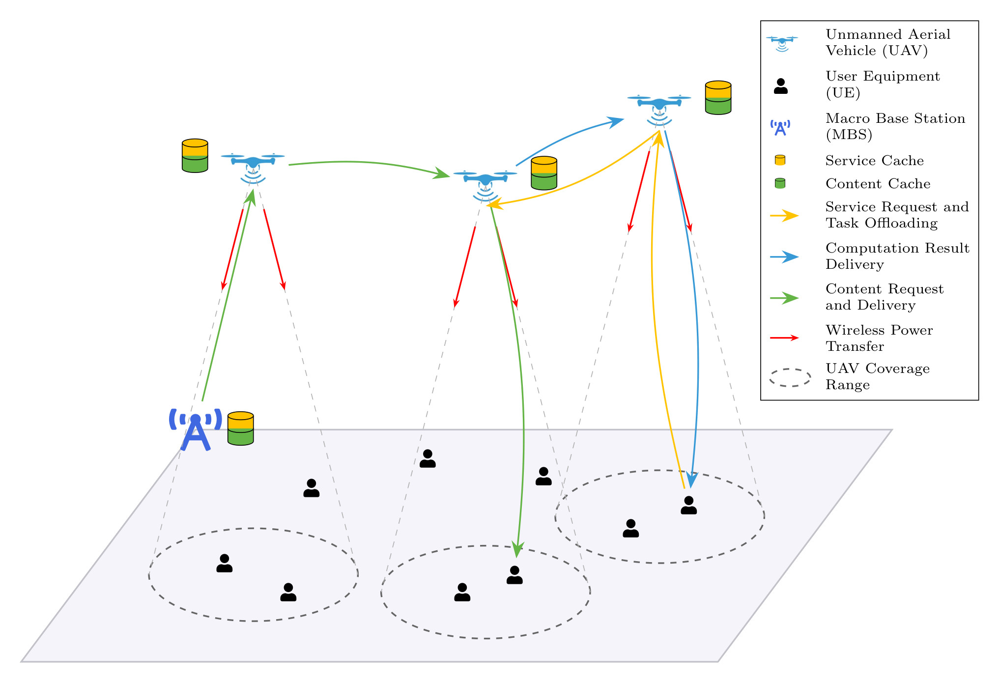

# Multi-UAV Assisted Wireless Powered Mobile Edge Computing: A Hybrid Optimization Approach

## Objective

The primary objective of this research is to develop a framework for a **multi-UAV-assisted collaborative Mobile Edge Computing (MEC)** network. We aim to jointly optimize the interdependent components: **task offloading decisions, service caching placement, content caching strategies, UAV trajectories and wireless power transfer**. The goal is to minimize service latency, system-wide energy consumption, device offline rate while simultaneously maximizing user fairness.

We are aiming to implement a hybrid optimization approach that combines multi-agent deep reinforcement learning with collaborative and adaptive caching policies. We are trying to create a generic framework that can be used with different models for finding the best-suited one for our purpose. We are also exploring incorporating **attention mechanisms** within the multi-agent reinforcement learning models for scalability and improved performance.

Also trying to incorporate modern Python practices and type annotations (Python 3.12+).

## 🎯 What's Included?

**MARL algorithms included:**
- **MADDPG**
- **MATD3**
- **MAPPO**
- **MASAC**
- **4 Attention Variants of above algorithms**

See [marl_models/README.md](marl_models/README.md) for further details.

**Advanced Features:**
- ✅ Offline rate tracking - Monitors device battery health
- ✅ Wireless Power Transfer - UAVs charge devices under critical battery levels
- ✅ Smart caching - Adaptive content placement
- ✅ Multi-agent coordination - Through MARL algorithms enhanced with attention mechanisms
- ✅ 3-stage tuning - Optimize reward weights, agent params, architecture

### Request-Level Offloading Extension

The current codebase also includes a **request-level offloading extension** for **service requests** while keeping the original UAV trajectory-control interface unchanged. UAV mobility actions are still `(NUM_UAVS, 2)`, and only the service-request offloading path is extended with a pluggable policy interface.

- `SERVICE_OFFLOAD_POLICY="heuristic"` keeps the original heuristic-style service offloading path as the baseline/fallback.
- `SERVICE_OFFLOAD_POLICY="learned"` switches service requests to a lightweight 3-way offloading policy: `local`, `cooperative`, or `MBS`.
- If `cooperative` is selected, the specific neighbor UAV is still chosen by the existing heuristic neighbor-selection logic.
- `content request` and `emergency energy request` behavior remain on the original logic path.

Important:
- The current `learned` policy expects a separately trained request-level classifier checkpoint.
- If the classifier checkpoint is missing or fails to load, the environment safely falls back to the original heuristic path.
- The request-level extension adds `deadline` and `priority` fields for service requests.
- `service_coverage` keeps its original fairness-oriented meaning and is not replaced by deadline satisfaction.



## 📁 Project Structure

```
.
├── environment/                 # Simulation
│   ├── env.py                   # Main simulation loop
│   ├── uavs.py                  # UAV dynamics
│   ├── user_equipments.py       # Device battery & requests
│   └── comm_model.py            # Communication & WPT
│
├── marl_models/                 # RL algorithms (see marl_models/README.md for detailed structure)
│
├── utils/                       # Utilities
│   ├── logger.py                # Training logs & metrics
│   ├── plot_logs.py             # Single run visualization
│   ├── plot_snapshots.py        # Snapshots of environment and trajectories
│   └── comparative_plots.py     # Multi-algorithm comparison
│
├── config.py                   # All parameters
├── train.py                    # Training script
├── test.py                     # Testing script
├── tune.py                     # Hyperparameter tuning with Optuna
└── main.py                     # Legacy interface
```

## ⚡ Setup Instructions

To run this project, you need to install PyTorch specifically for your system's hardware first, followed by the rest of the dependencies.

For Windows users with NVIDIA GPUs (CUDA 12.4), use:

```bash
pip install torch --index-url https://download.pytorch.org/whl/cu124
```

```bash
# Clone repository
git clone <repo_url>
cd Multi-UAV-Mobile-Edge-Computing-Hybrid-Optimization

# Create virtual environment (Python 3.12+)
python -m venv .venv
.venv\Scripts\activate  # Windows
# or: source .venv/bin/activate  # Linux/Mac

# Install dependencies
pip install -r requirements.txt
```

## 🚀 How to Use

### 📋 Requirements

- **Python** (3.12.0+)
- **PyTorch** (version as per your GPU and OS, along with any other dependencies)
- **NumPy**, **Matplotlib**, **Optuna** (and Plotly, Kaleido, Scikit-Learn for Optuna visualisation)

### Training

It can be used to start training from scratch or resume training from a previously saved checkpoint.

Before running, choose the service offloading mode in `config.py`:

```python
SERVICE_OFFLOAD_POLICY = "heuristic"  # or "learned"
SERVICE_OFFLOAD_POLICY_CHECKPOINT = None  # set this when SERVICE_OFFLOAD_POLICY == "learned"
```

Notes:
- Use `heuristic` if you want the closest behavior to the original repository.
- Use `learned` if you want to exercise the new request-level service offloading path with a trained classifier checkpoint.
- If `learned` is selected without a valid checkpoint, the runtime safely falls back to the heuristic offloading path.

Minimal request-classifier workflow:

```bash
python collect_offload_dataset.py --samples 5000 --output offload_datasets/offload_dataset_minimal.npz
python train_offload_policy.py --dataset offload_datasets/offload_dataset_minimal.npz --output saved_offload_policies/offload_policy_minimal.pt
```

```bash
# Start training from scratch
python main.py train --num_episodes=<total_episodes>

# To resume training from a saved checkpoint, specify no. of additional episodes, path to the saved checkpoint, and path to the saved config file (to load and use the same settings).
python main.py train --num_episodes=<additional_episodes> --resume_path="<path_to_checkpoint_directory>" --config_path="<path_to_saved_config>"

```

### Hyperparameter Tuning

Optimize reward weights and agent parameters with **3-stage tuning**:

```bash
# Stage 1: Optimize reward weights (ALPHA_1, ALPHA_2, ALPHA_3, ALPHA_4): helps understand reward trade-offs
python tune.py --stage 1 --episodes 500 --trials 50

# Stage 2: Optimize learning rates, batch sizes, network architecture: find best agent hyperparameters
python tune.py --stage 2 --episodes 1000 --trials 50

# Stage 3: Optimize attention architecture (attention models only): tune ATTN_HIDDEN_DIM and ATTN_NUM_HEADS
python tune.py --stage 3 --episodes 500 --trials 30
```

### Testing

It can be used to test a saved model for a specified number of episodes.
To test a saved model, you must provide the path to the model's directory and its corresponding configuration file.

```bash
# Start testing, with saved model path and config file saved during that model's training run (to load and use the same settings).
python main.py test --num_episodes=<total_episodes> --model_path="<path_to_model_directory>" --config_path="<path_to_saved_config>"
```

### New Metrics

The request-level extension adds the following logged metrics:

- `deadline_satisfaction_rate`
- `offloading_ratio_local`
- `offloading_ratio_cooperative`
- `offloading_ratio_mbs`
- `mbs_load_ratio`

Current interpretation:
- `deadline_satisfaction_rate` is defined for **service requests only**.
- `offloading_ratio_local`, `offloading_ratio_cooperative`, and `offloading_ratio_mbs` are service-request offloading ratios.
- `mbs_load_ratio` tracks the fraction of generated service requests routed to MBS.
- In the current `train.py` / `test.py` pipeline, these metrics are logged as **per-step ratios averaged across the episode**. They are **not** yet strict count-weighted episode aggregates.

### Minimal Example

Set the offloading mode in `config.py`:

```python
SERVICE_OFFLOAD_POLICY = "heuristic"
```

or:

```python
SERVICE_OFFLOAD_POLICY = "learned"
SERVICE_OFFLOAD_POLICY_CHECKPOINT = "saved_offload_policies/offload_policy_minimal.pt"
```

Then run:

```bash
python main.py train --num_episodes=5
python main.py test --num_episodes=2 --model_path="<path_to_model_directory>" --config_path="<path_to_saved_config>"
```

### Visualization

```bash
# Compare multiple algorithms
python compare_algorithms.py \
    --logs train_logs/maddpg_run train_logs/matd3_run train_logs/mappo_run \
    --names MADDPG MATD3 MAPPO \
    --output comparison_plots \
    --smoothing 10
```

Refer [Plotting Module](./docs/PLOTTING_MODULE.md) for detailed plotting plan.

## 👨‍💻 Contributors

- Roopam Taneja
- Vraj Tamakuwala

**PS: Currently under rapid development and may be subject to significant changes.**

### Made with ❤️
